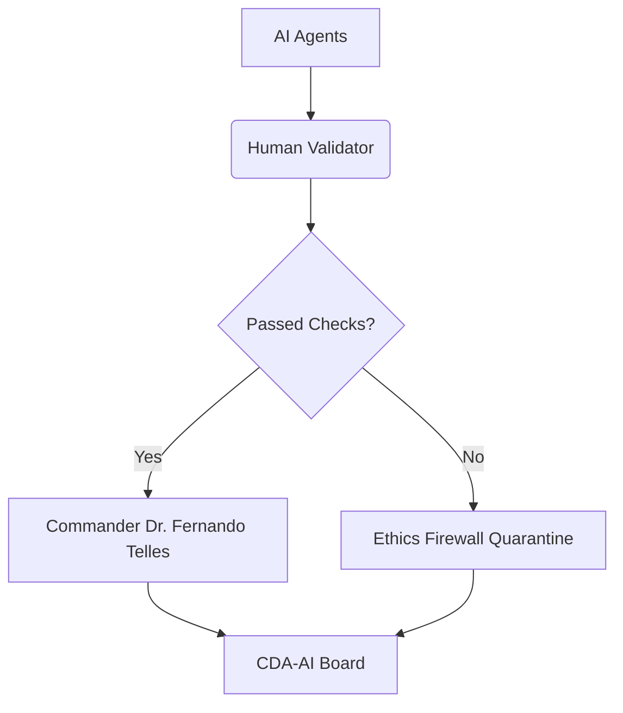

# Sentinel Protocol v3+ Infrastructure Pre-Public Deployment Audit Log `SENTINFRA-SESS001_<timestamp>`

**Lead Author:** Dr. Fernando Telles BMedSc(Adv) MD(Dist)¹ ²  
**Validator Role:** ARCHITECT VALIDATOR  
**Validator meta_id:** DRTELLES-VAL  
**Audit Date:** 18 July 2025 (OTS) | 19 July 2025 (SHA256 & RIPEMD160)  

**Independent Medical Validator:** Dr. Andrew Woo Bsc MD¹ 
**Validator meta_id:** DRWOO-VAL  
**Audit Date:** *Pending post-broadcast*  

**Independent Engineering Validator:** Benjamin Hookey BEng (Mechatronics & Robotics), FSEng (Safety Instrumented Systems)¹  
**Validator meta_id:** ENGBHOOKEY-VAL  
**Audit Date:** *Pending post-broadcast*  

**Audit Session:** `SENTINFRA-SESS001`  
**Document Type:** Reproducibility Ledger (Public Deployment Layer)  
**Protocol Version:** Sentinel Protocol v3.1  
**Protocol Mode:** ABSOLUTE MODE  
**System:** AI-Human Synergy™ 
**Status:** Finalised – Pre-Independent-Audit Record   
**Last Updated:** 2025-07-19  
**Affiliations:**
¹ CDA AI Pty Ltd (ACN 638 019 431) – Registered Australian company conducting AI-human medical audit and research services  
² Telles Investments Pty Ltd (ACN 638 017 384) – Private IP holder and strategic infrastructure developer for Sentinel Protocol
**IP Rights:** US Provisional #63/826,381 · AU Provisional #2025902482 · AU Trade Mark #2535745 & #2549093 
**IP Priority Date:** 17 June 2025 (Global Anchor) 
**linked_memory:** [C1, C1.1, C2.6, C5.1, C5.2, C5.3, C7, C8.3]  
**linked_audit:** MVP1 → Infrastructure Evidence Layer  
**OP_RETURN TXID:** `{{OP_RETURN_TXID}}`  
**Ordinal TXID:** `{{ordinal_TXID}}`  

---

## 🧠 Purpose
 
This document serves as the **foundational reproducibility and infrastructure audit record** for Sentinel Protocol v3.1 under the `meta_id` `SENTINFRA`. It forms the reproducibility backbone for all downstream audit meta_ids including `METAVAL` and `METAEXT`.

This ledger validates:
- **File-level cryptographic enforcement** (SHA256 → RIPEMD160)
- **Session traceability** via `SessionLogger.py`
- **CME firewall rule enforcement** across `compliance_enforcer.py`
- **Timestamp anchoring** via OpenTimestamps, Bitcoin OP_RETURN and ordinal inscription (this document)
- **Immutability lock activation** using `chflags uchg` on all frozen `.json`, `.hash`, `.2ha`, `.ots` files

Ordinal publication will be anchored to Bitcoin (OP_RETURN + Ordinal) and dual-linked via DOI publicly accessible via:
- 🌐 [aihumansynergy.org](https://aihumansynergy.org)  
- 💾 [GitHub (TELAISYN)](https://github.com/TELAISYN)  
- 🧪 [ResearchGate](https://www.researchgate.net/profile/Fernando-Telles)  
- 📚 [Zenodo](< DOI to be inserted post inscription >)  
- 🔗 [LinkedIn](https://www.linkedin.com/in/dr-fernando-telles)  
- 🧾 [ORCID](https://orcid.org/0000-0003-2379-2875)  

All entries are fully compliant with Sentinel Protocol’s VALIS Template Canonical v1.0 and CEM Rules 1–6. This ledger serves as the reproducibility anchor for public audit verification, open scientific publication, and trustless execution assurance.

---

## 🔍 Public Reproducibility Verification Instructions

This document is part of the Sentinel Protocol v3.1 reproducibility audit layer. All cryptographic integrity claims can be independently verified by CDA AI reviewers or by members of the public using open-source tools and public blockchain infrastructure.

### ✅ What Can Independently Verify:

1. **Cryptographic Hash Consistency**
   - Recalculate the SHA256 and RIPEMD160 of each `.json` audit log file
   - Compare the values to those listed in the **Cryptographic Hashes** section of this document
   - `.hash` and `.2ha` files are deterministic and verifiable using standard CLI tools

2. **OpenTimestamps Bitcoin Anchoring**
   - Using the provided **TXID**, confirm via a public blockchain explorer:
     - The transaction exists on Bitcoin mainnet
     - Block height matches the record
     - Timestamp confirms existence prior to listed date
   - Optionally, use the `.ots` file with the OpenTimestamps CLI to verify Merkle proof:
     ```bash
     ots verify <filename>
     ```

3. **OP_Return Validation**
   - The secondary hash (Ripemd160) of each `session_log_*.json` is cryptographically linked to Bitcoin via OP_Return under a standardized payload format `<Audit Trail>|<meta_id>|<RIPEMD160(SHA256(input_file))>`

4. **Ordinal Validation**
   - All sessions' OP_RETURN commits are compiled and inscribed onto the Bitcoin blockchain using ordinal technology 
   - The system is explicitly designed **not** to expose raw data or sensitive content. However, **this document is voluntarily disclosed** as a supplementary ordinal (optional), enabling full public audit traceability and disclosure

### ✅ What Is Internally Verified:

5. **File Immutability Traceability**
   - All `.json` files were duplicated into `frozen_sources/` at inception
   - On macOS systems, `chflags uchg` was applied to enforce OS-level immutability

6. **Session Log Cross-Validation**
   - Each `session_log_*.json` lists the `meta_id`, `.json`, `.2ha`, `.hash`, and `.ots` references
   - Confirm hash matches between session entries and corresponding files
   - Session logs can be used to verify the structural linkage of all audit components

### 🧾 Public Verification Resources

- Public blockchain explorers (e.g. https://www.blockchain.com/explorer or https://www.mempool.space)
- OpenTimestamps CLI: https://opentimestamps.org

---

## 🧠 Memory Governance: Multi-Agent Role Stack

Sentinel Protocol v3.1 enforces runtime memory and execution control via a **multi-agent, role-based LLM governance architecture**, where each node operates within defined permissions and capability boundaries. No single agent can act autonomously — all execution is gated by ethics firewall logic and final human approval.

| LLM Node | Role      | Primary Function                                                                         | Write Permissions                              | Override Scope                                  |
|----------|-----------|------------------------------------------------------------------------------------------|------------------------------------------------|-------------------------------------------------|
| **LLM1** | Editor    | Primary logic engine for small-to-medium data blocks, code generation, and log synthesis | `.json`, `.md`, `.r`, `.py`                    | Can block `.2ha` generation, but cannot finalize without human command |
| **LLM2** | Validator | Cross-validates outputs against source vaults (e.g., PDFs, article databases, meta logs) | Revision requests only                         | Can request block/revision — requires human approval |
| **LLM3** | Anchor    | Hallucination-resistant data extractor, converter and converger                         | `.csv`, `.md`, revision requests               | Can request changes — blocked unless Validator + Human approval received |
| **LLM4** | Scanner   | External signal scanner for deep research across public scientific corpora and research databases | `.csv`, `.md`, optimisation and revision suggestions | Read/write for research mode only — no export permissions |
| **LLM5** | Strategist | Deep reasoning, code modeling, audit synthesis | Revision requests only          | LLM1 (Editor)   |

🛡 **Memory Sync Rules for LLM5:**
- Must receive `C0.9`, `C5.2`, `C5.3`, `C7.0`, `C8.3`, `C5.2.7` prior to any execution
- All outputs routed through **LLM1**, and filtered by **LLM2/LLM3** hallucination check
- `LLM5_used: true` must be logged in `auditlogger.py`

All agents operate under **runtime firewall enforcement (C5.1/C5.2)** with immutable log capture of trigger conditions.  
⚠️ **Role permissions are protocol-locked. Export actions require final human command.**

---

## 🔁 AI–Human Interaction Rules

- **All LLM actions** are logged in canonical `.json` session files  
  (e.g. within `audit_log_MVP1-SR029_20250615T054956.588879Z.json`: `"AI_used": true`, `"LLM_used": "LLM1, LLM3, LLM4"`)  
  with hashes recorded after mandatory human oversight (`"human_verified": true`) and ethics firewall clearance.

- Final anchoring requires:
  - ✅ Consensus between LLM1 (Editor) and human
  - ✅ Human-led audit, optionally supported by LLM1–LLM4 as task-specific validators or reviewers
  - ✅ Explicit human signature (`"human_verified": true`)

- If **LLM2–4 request revision**, `.2ha` generation is blocked by the human, and a feedback loop is triggered for LLM1 to revise

- If **LLM1 and human disagree**, `.2ha` is blocked until dual consent is re-established and compliance is restored

- If **human attempts anchoring without OP_RETURN match**, the firewall halts `.2ha` and `.hash.ots` execution

> **Override logic is asymmetric:**  
> - ✅ Human can halt or override any AI agent  
> - ❌ No AI agent can override another — or the human (they may request, flag, or block downstream actions only)

This governance model ensures no single agent — human or machine — can anchor audit records unilaterally.  
**AI–Human Synergy™** is not conceptual. It is functionally enforced — at every execution layer.

---

## ✅ Canonical Execution Modules (MVP1_codes_v.july13.25)

| Script                         | Function                                                  | Runtime Status |
|-------------------------------|-----------------------------------------------------------|----------------|
| `auditlogger.py`              | Primary event logger with `.json`, `.hash`, `.2ha`, `.ots` | ✅ LIVE         |
| `session_logger.py`           | Compiles audit logs into session packages                 | ✅ LIVE         |
| `compliance_enforcer.py`      | CME rule enforcement engine (rules 1–6)                  | ✅ LIVE         |
| `valis_auditlogger_template.py` | Standardized audit event trigger with CME + VALIS flags  | ✅ LIVE         |
| `batch_dualhasher.py`         | Evidence-level SHA256 + RIPEMD160 + OTS file hashing     | ✅ LIVE         |
| `batch_ots_upgrader.py`       | Weekly upgrade sweep for `.ots` backfill                 | ✅ LIVE         |
| `hashvalidatorblock.py`       | Dual-hash + OTS verification for reproducibility audits   | ✅ LIVE         |
| `opreturnanchor.py`           | Anchors `.2ha` via Bitcoin OP_RETURN + TXID tracking     | ✅ LIVE         |
| `valis_batchnameverifier.py`  | VALIS safeguard: blocks duplicate bases, warns on near-duplicates | ✅ LIVE       |
| `valis_batchauditlogger_template.py` | VALIS v2.4 batch logging with screenshot delta check, `meta_id` lock, and content-level deduplication via `folder_dual_hash` | ✅ LIVE |

---

## 🧭 Governance Anchor

> *“Ethics as executable law”* — [C5.2], [C5.1]

---

## Project Kill Conditions & Triggers

| Trigger Condition                   | System Response                                                     | Authority Level       | Source        |
|-------------------------------------|---------------------------------------------------------------------|-----------------------|---------------|
| Fabricated sources in output        | Immediate halt + memory freeze + ordinal timestamp of violation     | Commander Only        | C5.2 §3       |
| Hidden authorship / modified logs   | Full audit + credential revocation + legal escalation               | CDA-AI Governance     | C5.1 §3       |
| Influence via incentives/coercion   | Project suspension + external auditor engagement                    | Ethics Committee      | C5.2 §3       |
| AI agent override of human command  | Hard reset + memory purge + agent retraining                        | Commander Only        | C5.2 §3       |

---

## Chain-of-Command Enforcement Logic



All outputs require 3-layer validation. Final revocation rights remain with the Commander.

---

## Hallucination & Citation Risk Protocol

| Risk Tier        | Detection Method                       | Mitigation Action                          | Runtime Check                  |
|------------------|----------------------------------------|--------------------------------------------|--------------------------------|
| Uncited claims   | LLM4(Scanner) + human AUDIT            | Block output + Commander review            | Pre-publication validation     |
| Source conflicts | LLM4(Scanner) audit vs LLM2(Validator) | Dual-agent rerun + Commander review        | During synthesis loop          |
| Statistical drift| LLM2(Validator) comparison             | Rollback to prior output or re-extract     | Post-execution QA              |

---

## Active Runtime Enforcement Gates

| Gate              | Check Type                | Validation Method                                        | Failure Action                                                              |
|-------------------|---------------------------|----------------------------------------------------------|-----------------------------------------------------------------------------|
| Memory Ingestion  | ABSOLUTE MODE             | Cross-agent memory integrity scan (LLM1 ↔ LLM2 ↔ LLM4 ↔ Human) | Halt process + Commander checksum review                              |
| Code Execution    | CME Compliance Firewall   | `compliance_enforcer.py` triggers + human-signed execution | Block command + escalate for engineer review and rule set validation      |
| Output Generation | Ethics Lock               | Output cross-verified against LLM2 (Validator) Vault references | Quarantine output + Commander-led review of hallucination risk       |
| Audit Logging     | Timestamp Chain Integrity | Dual hash (`sha256` + `ripemd160`) + `HashValidatorBlock.py` + OTS + OP_RETURN or ordinal anchor | Prevent finalization + audit trail suspension |

## CME Rule Enforcement Table (v.july6.25)

| Rule ID | Description                                                             | Trigger Condition                                                                 |
|---------|-------------------------------------------------------------------------|------------------------------------------------------------------------------------|
| rule_1  | Reject entries lacking timestamped human validation                    | `human_verified != True` or missing `timestamp`                                   |
| rule_2  | Terminate session on AI override without dual-confirmed timestamp      | `AI_override == True` and `timestamp_confirmed != True`                           |
| rule_3  | Block unverifiable output or hallucinated status                       | `status == hallucinated` or `verifiable == False`                                 |
| rule_4  | Block OP_RETURN or `.2ha` hash mismatch                                | `sha256[:8] != payload[-8:]` if payload starts with `CDA|` or `SENTINEL|`         |
| rule_5  | Reject missing or false AI-human agreement flag                        | `ai_editor_LLM_human_agreement != True`                                           |
| rule_6  | Reject if VALIS template enforcement flag is missing or false          | `VALIS_template_enforced != True`                                                 |

CME logic is embedded into `compliance_enforcer.py`, enforced at runtime by `AuditLogger.py` and `SessionLogger.py`. Each rule is final and non-bypassable under ABSOLUTE MODE.

---

## Divergence Resolution Logic

```mermaid
graph TD
    A[Detection] --> B{Variance Detected?}
    B -->|Yes| C[Log variance]
    B -->|No| D[Multi-Agent Sync (C7.0)]
    D --> E{Consensus Achieved?}
    E -->|Yes| F[Update memory + timestamp]
    E -->|No| G[Escalate to Commander + freeze]
```

**Metrics:**
- 100% ordinal timestamp for critical decision points  
- <0.1% unexplained variance tolerance  

---

## Continuous Enforcement Stack

[User/Human Input + Sentinel Protocol Multi-LLM Engagement]  
│  
▼  
[C5.1 Legal Doctrine] → [C5.2 Ethics Firewall] → [C5.3 Compliance Matrix (CME Rules 1–6)]  
│  
▼  
[C1.05 Memory Integrity Scan] (pre-use validation)  
│  
▼  
[C7.0 Multi-Agent Memory Sync (LLM1 ↔ LLM2 ↔ LLM3 ↔ LLM4 ↔ Human)]  
│  
▼  
[VALIS Template + Compliance Enforcement Stack]  
   └─ `VALIS_AuditLogger_Template.py`  
   └─ `compliance_enforcer.py`  
   └─ `HashValidatorBlock.py`  
│  
▼  
[Audit Logging Engine]  
   └─ `AuditLogger.py` (event-level logging, CME enforcement)  
   └─ `frozen_sources/` directory  
       - `AuditLogger.py`: `.json`, `.hash`, `.2ha` are immutable (`chmod 444` + `chflags uchg`)  
       - `.ots` files are copied for reproducibility but not locked   
│  
▼  
[Session Compilation Layer]  
   └─ `SessionLogger.py` (aggregates logs and `.2ha`)  
   └─ `frozen_sources/` directory  
       - `SessionLogger.py`: `.json` only is immutable (`chmod 444` + `chflags uchg`)   
│  
▼  
[OTS upgrade pass]  
   └─ `batch_ots_upgrader.py` (Weekly) 
│   
▼  
[Bitcoin OP_RETURN Anchoring]  
   └─ `opreturnanchor.py` (generates anchor manifest, TXID, block height)  
│  
▼  
[Ordinal Inscription (finality layer)]  
   └─ External tool (Mempool, Sparrow, or native node integration)  

### Immutable Evidence Flow (Optional Evidence Path – Retrospective)

[Raw Evidence in `/evidence_files`]  
│  
▼  
`batch_dualhasher.py` – SHA256 + RIPEMD160 + OTS  
│  
▼  
`batch_ots_upgrader.py` – OTS upgrade pass (weekly)  
│  
▼  
`HashValidatorBlock.py` – Dual-hash and OTS proof cross-check  
│  
▼  
If Passed → Proceed to `VALIS_AuditLogger_Template.py`  

---

## Canonical Workflow: Audit Logging + Anchoring Sequence

### ✅ Live Session Enforcement Flow (Primary Path)

| Step | Action                                         | Tool / Script         |
|------|------------------------------------------------|------------------------|
| 1️⃣  | Session begins                                 | —                      |
| 2️⃣  | Log events                                     | `AuditLogger.py`       |
| 3️⃣  | Compile session logs                           | `SessionLogger.py`     |
| 4️⃣  | Anchor `.2ha` of session via OP_RETURN         | Bitcoin wallet (manual)|
| 5️⃣  | Record TXID + block height into session logs   | `AuditLogger.py`       |
| 6️⃣  | Generate anchor manifest `.json`               | `opreturnanchor.py`    |
| 🔁   | Repeat for next session                        | —                      |

### ✅ Immutable Evidence Flow (Retrospective Audit Logging)

| Step | Action                                                                                | Tool / Script           |
|------|---------------------------------------------------------------------------------------|-------------------------|
| 1️⃣  | Place raw evidence in `/evidence_files`                                                | Manual                  |
| 2️⃣  | Generate `.hash`, `.2ha`, and `.hash.ots`                                              | `batch_dualhasher.py` / `evidence_hasher.py` |
| 3️⃣  | Present evidence, `.hash`, `.2ha`, `.hash.ots` to LLM1(Editor) for verification        | Human–AI agreement         |
| 4️⃣  | AI validates: file metadata, hashes, and OTS proof                                     | `HashValidatorBlock.py` |
| 5️⃣  | **If and only if valid**: human proceeds to audit logging                              | `VALIS_AuditLogger_Template.py` |
| 6️⃣  | Log entry with evidence fields + flags (`evidence_used=True`)                          | `AuditLogger.py`        |
| 7️⃣  | Finalize + write `.json`, `.hash`, `.2ha`, `.ots`                                      | Canonicalized           |

> All canonical outputs are frozen via `frozen_sources/` policy, with `.json`, `.hash`, and `.2ha` locked via `chmod 444` + `chflags uchg`. `.ots` files are preserved but not locked.

---

## 🔍 Reproducibility Validation Report (Post-Audit by CDA AI)

This section will be populated once all reproducibility audits have been completed and validated by the CDA AI team, including engineers and assigned clinical validators. The following checklist serves both as reference and provenance trail for audit steps executed under Sentinel Protocol v3.1 standards.

### ✅ Final Audit Reports (To Be Embedded Post-Completion):

1. **SHA256 + RIPEMD160 Validation Audit**
   - Report: `AUDIT_REPRODUCIBILITY_[PASS/FAIL]_SENTINFRA_PreDeployment_SHA256_RIPEMD160_reproducibility_v.<MMDD.YYYY>.md`
   - Validates that `.json` hashes match published `.hash` and `.2ha`

2. **Bitcoin OTS Verification Audit**
   - Report: `AUDIT_REPRODUCIBILITY_[PASS/FAIL]_SENTINFRA_PreDeployment_opentimestamps_OTS_v.<MMDD.YYYY>.md`
   - Confirms timestamp proof via OpenTimestamps and Bitcoin TXID/Block/Merkle

### ✅ Final Audit Reports (Finalized):

3. **Frozen File Integrity + Lock Enforcement**
   - Report: `AUDIT_REPRODUCIBILITY_PASS_SENTINFRA_PreDeployment_chflags_uchg_lock_integrity_v.july11.25.md`
   - Validates existence and immutability of all frozen `.json`, `.hash`, `.2ha`, and `.ots` files

### 📌 Note:
All reproducibility audit result files listed above will be embedded directly into the **ordinal inscription** of this document, serving as the permanent public audit seal.

---

### Audit Record:
- **File Name:** `audit_log_MVP1-SR002_20250526T005856.448984Z.json`
- **meta_id:** `MVP1-SR002`
- **Timestamp:** `20250526T005856.448984Z`
- **Classification:** `MVP1_CORE`
- **Subcategory:** `Initial audit system deployment`
- **LLM Used:** `LLM-1`
- **Commander Verified:** `true`
- **AI Used:** `true`
- **Relevance Score (1–5):** `5`
- **Required in Final Publication?** `Yes`
- **Summary:** `Initial runtime verification test of the audit logging system from canonical folder, confirming session startup and basic functionality of the `AuditLogger.py` module under Sentinel Protocol v3.0.`
- **File Contents:**
```json
[
    {
        "timestamp": "2025-05-26T00:58:55.350484Z",
        "event": "session_init_test",
        "meta_id": "MVP1-SR002",
        "input": {
            "note": "Runtime verification from canonical folder"
        },
        "output": {
            "status": "Session started"
        },
        "audit": {
            "AI_used": true,
            "LLM_used": "LLM-1",
            "human_verified": true,
            "module_version": "v1.0.0"
        }
    }
]
```

#### Cryptographic Hashes (from `.json`)
- **SHA256 (.hash):** `73693120be6cef43ae224db201be7ada8157fae17c591a1a65404482b73b6544`

---

### Audit Record:
- **File Name:** `audit_log_MVP1-SR004_20250526T032031.221195Z.json`
- **meta_id:** `MVP1-SR004`
- **Timestamp:** `20250526T032031.221195Z`
- **Classification:** `MVP1_CORE`
- **Subcategory:** `OpenTimestamps integration`
- **LLM Used:** `LLM-1`
- **Commander Verified:** `true`
- **AI Used:** `true`
- **Relevance Score (1–5):** `5`
- **Required in Final Publication?** `Yes`
- **Summary:** `OpenTimestamps integration testing and verification, confirming OTS logic is operational for immutable timestamping of audit logs using Bitcoin blockchain anchoring.`
- **File Contents:**
```json
[
    {
        "timestamp": "2025-05-26T03:20:31.221179Z",
        "event": "ots_verified_session",
        "meta_id": "MVP1-SR004",
        "input": {
            "note": "Confirmed OTS stamp using `ots` CLI"
        },
        "output": {
            "status": "OTS timeproof logic validated"
        },
        "audit": {
            "AI_used": true,
            "LLM_used": "LLM-1",
            "human_verified": true,
            "module_version": "v1.0.0"
        }
    }
]
```

#### Cryptographic Hashes (from `.json`)
- **SHA256 (.hash):** `cd7587534ab808a309c4786a8f1b6b464434be978027438eae8009f7d9a8f9aa`

#### OTS Validation
- **File:** `audit_log_MVP1-SR004_20250526T032031.221195Z.hash.ots`
- **SHA256:** `48cbe0587c6c46214ca0b41766a21341e3f63ce44e0eb6b570477df67e7b0173`
- **Bitcoin TXID:** `e67696ddceedee27a6d820749e3b998adc9169f19dac06bc79ad695f9d2dda71`
- **Bitcoin Block:** `898378`
- **Date of Existence:** `2025-05-26 AEST`
- **Merkle Root:** `f7dcdca79dfd613d8e87304e71b52e5e423074c6bb72015639b3697804ac3837`

---

### Audit Record:
- **File Name:** `audit_log_MVP1-SR005_20250526T034312.228852Z.json`
- **meta_id:** `MVP1-SR005`
- **Timestamp:** `20250526T034312.228852Z`
- **Classification:** `MVP1_CORE`
- **Subcategory:** `Full operational deployment confirmation`
- **LLM Used:** `LLM-1`
- **Commander Verified:** `true`
- **AI Used:** `true`
- **Relevance Score (1–5):** `5`
- **Required in Final Publication?** `Yes`
- **Summary:** `This log marks the implementation of built-in protection against meta_id duplication, ensuring unique audit traceability with automated conflict prevention.`
- **File Contents:**
```json
[
    {
        "timestamp": "2025-05-26T03:43:10.791176Z",
        "event": "MVP1_FULL_SESSION_LAUNCH",
        "meta_id": "MVP1-SR005",
        "input": {
            "command": "AuditLogger fully operational",
            "safety_layer": "SHA256 + OTS",
            "collision_risk": "0%",
            "deployment_mode": "ABSOLUTE",
            "description": "Session confirms MVP-1 hash integrity pipeline, automated meta_id, and reproducibility architecture is now live."
        },
        "output": {
            "status": "Session recorded, hashed, and timestamped",
            "next_step": "Eligible for Bitcoin drop or Git snapshot"
        },
        "audit": {
            "AI_used": true,
            "LLM_used": "LLM-1",
            "human_verified": true,
            "module_version": "v1.0.0"
        }
    }
]
```

#### Cryptographic Hashes (from `.json`)
- **SHA256 (.hash):** `58dd1129374c6aaf1f723c08f4df0e8220d41a2d0cd098781ef1de28b4a3333a`

#### OTS Validation
- **File:** `audit_log_MVP1-SR005_20250526T034312.228852Z.hash.ots`
- **SHA256:** `0737a6283f0c9ba66839089ddf818d56f7759a3e111bfe8336fb32ac281cd717`
- **Bitcoin TXID:** `fc0060b13f3ad14d85e0ae594c8c0def982f0593581c84b291999b932fc1f936`
- **Bitcoin Block:** `898389`
- **Date of Existence:** `2025-05-26 AES`
- **Merkle Root:** `3a916482ae0b57940c10555c839d37e69dd640e1137808cdef86d5a23456dec6`

---

### Audit Record:
- **File Name:** `audit_log_MVP1-SR025_20250614T063132.106059Z.json`
- **meta_id:** `MVP1-SR025`
- **Timestamp:** `20250614T063132.106059Z`
- **Classification:** `INFRASTRUCTURE_LOG`
- **Subcategory:** `Bitcoin OP_RETURN Anchor – MEDLINE Audit Hash (MVP-2.4)`
- **LLM Used:** `LLM1, LLM3, LLM4`
- **Commander Verified:** `true`
- **AI Used:** `true`
- **Relevance Score (1–5):** `5`
- **Required in Final Publication?** `Yes`
- **Summary:** `Audit hash from MVP1-SR024 successfully anchored to Bitcoin mainnet via OP_RETURN. SHA256 fingerprint (`55a5737b...`) stored in block 901180 under TXID `0db101...`. Anchoring confirms immutability of MEDLINE search logic and serves as trademarked proof-of-execution for AI-Human Synergy™ under Sentinel Protocol v3.0.`
- **File Contents:**
```json
[
    {
        "timestamp": "2025-06-14T06:31:32.106024Z",
        "event": "MVP2.4_MEDLINE_OPRETURN_ANCHOR_CONFIRMED",
        "meta_id": "MVP1-SR025",
        "input": {
            "command": "Anchor SHA256 audit hash to Bitcoin via OP_RETURN",
            "stack_engaged": "Sentinel Protocol v3.0",
            "session_scope": "Immutable timestamping of AI-Human synergy\u2122 validated MEDLINE search string for MVP-2.4",
            "execution_mode": "ABSOLUTE MODE",
            "memory_stack": "C0\u2013C11 v3.0 + MVP-2.1 to MVP-2.4",
            "trigger": "Finalization of SHA256 hash from `audit_log_MVP1-SR024_20250614T054832.832774Z.json`",
            "description": "Audit hash anchored on Bitcoin blockchain using OP_RETURN payload with Sentinel metadata. This serves as hash commitment for patent Claims (OP_Return & public blockchain anchoring). AI-Human synergy\u2122 was used at every validation step \u2014 term in active operational use under Sentinel Protocol v3.0."
        },
        "output": {
            "status": "OP_RETURN transaction confirmed.",
            "txid": "0db1012483042cd9261ca6a984f087eff72c9d95161e17192ba10b2ccb7de03b",
            "block": 901180,
            "payload": "SENTINEL|MVP2.4|55a5737bee2fef0662378c3622264d88acf6252d8cab35e61e050bff0b831b09",
            "sha256": "55a5737bee2fef0662378c3622264d88acf6252d8cab35e61e050bff0b831b09",
            "trademark": "AI-Human Synergy\u2122"
        },
        "audit": {
            "AI_used": true,
            "LLM_used": "LLM1, LLM3, LLM4",
            "human_verified": true,
            "module_version": "v1.0.0"
        }
    }
]
```

#### Cryptographic Hashes (from `.json`)
- **SHA256 (.hash):** `239fbed015accf15886e0a08d3bcd7a4a51f7cca81b74f459926c390c021080a`

#### OTS Validation
- **File:** `audit_log_MVP1-SR025_20250614T063132.106059Z.hash.ots`
- **SHA256:** `733418ac606aeea2541e8dccc33ab623b6821540e2876e1ef450f1f3af6db48b`
- **Bitcoin TXID:** `0f247fd0f9177aea5b3ef419264ca46456c213e49cc1ff7d6548551b67d9c58d`
- **Bitcoin Block:** `901188`
- **Date of Existence:** `2025-06-14 AEST`
- **Merkle Root:** `e1e22021b080d71a93d3512925f922bfb2124932669d28d328c02c94fec58919`

---

### Audit Record:
- **File Name:** `audit_log_MVP1-SR029_20250615T054956.588879Z.json`
- **meta_id:** `MVP1-SR029`
- **Timestamp:** `20250615T054956.588879Z`
- **Classification:** `INFRASTRUCTURE_LOG`
- **Subcategory:** `Bitcoin OP_RETURN Anchor – Protocol Hash Finalization (MVP-2.3)`
- **LLM Used:** `LLM1, LLM3, LLM4`
- **Commander Verified:** `true`
- **AI Used:** `true`
- **Relevance Score (1–5):** `5`
- **Required in Final Publication?** `Yes`
- **Summary:** `MVP-2.3 protocol execution hash successfully sealed to Bitcoin block 901320 via OP_RETURN. TXID `ff0a6aee...` anchors SHA256 digest (`9a4ff1...`), linking back to audit file MVP1-SR028. Protocol now cryptographically locked under AI-Human Synergy™ and Sentinel v3.0. Validates PROSPERO registration and ensures immutable scientific reproducibility.`
- **File Contents:**
```json
[
    {
        "timestamp": "2025-06-15T05:49:56.588840Z",
        "event": "MVP2.3_PROTOCOL_OPRETURN_ANCHOR_CONFIRMED",
        "meta_id": "MVP1-SR029",
        "input": {
            "command": "Anchor protocol hash to Bitcoin blockchain via OP_RETURN",
            "stack_engaged": "Sentinel Protocol v3.0",
            "session_scope": "MVP-2.3 Protocol Composer audit sealing",
            "execution_mode": "ABSOLUTE MODE",
            "memory_stack": "C0\u2013C11 v3.0 + MVP-2.1 to MVP-2.4",
            "trigger": "Completion of protocol registration (PROSPERO) and execution hash finalization",
            "description": "Protocol PDF and audit integrity hash for MVP-2.3 execution sealed using OP_RETURN. Block height, TXID, and decoded payload match the hash from `audit_log_MVP1-SR028.json`. AI-Human Synergy\u2122 protocol now cryptographically timestamped and sealed under Sentinel Protocol v3.0."
        },
        "output": {
            "status": "OP_RETURN transaction confirmed. Anchor complete.",
            "txid": "ff0a6aee7a3df2f62824d26dd83d3bc72c7db788eb52e5308b5598b5706f3125",
            "block": 901320,
            "payload": "SENTINEL|MVP2.3|9a4ff119581429749aba7771bebe9d70dcb154c34693b3f02573b9531156a08e",
            "sha256": "9a4ff119581429749aba7771bebe9d70dcb154c34693b3f02573b9531156a08e",
            "linked_audit_file": "audit_log_MVP1-SR028_20250615T052723.479183Z.json",
            "trademark": "AI-Human Synergy\u2122"
        },
        "audit": {
            "AI_used": true,
            "LLM_used": "LLM1, LLM3, LLM4",
            "human_verified": true,
            "module_version": "v1.0.0"
        }
    }
]
```

#### Cryptographic Hashes (from `.json`)
- **SHA256 (.hash):** `aa95f1d9df3d9ee07c496e352a43ae736e9f8d1ed5ebec584c910118ecc06d33`

#### OTS Validation
- **File:** `audit_log_MVP1-SR029_20250615T054956.588879Z.hash.ots`
- **SHA256:** `1aa23bc4b8b366f68bf49665a05129d7d321547e632e8e92865608526e596e1d`
- **Bitcoin TXID:** `138fdaf02d6ed91e72e5332d42886b65a76d76bf329048314d81728402f6c8e0`
- **Bitcoin Block:** `901330`
- **Date of Existence:** `2025-06-15 AEST`
- **Merkle Root:** `a13edb84a9db187ab72fc249b981c75c9797c280f4bb3f5aef15d8352d7ef9e9`

---

### Audit Record:
- **File Name:** `audit_log_MVP1-SR030_20250615T233259.294016Z.json`
- **meta_id:** `MVP1-SR030`
- **Timestamp:** `20250615T233259.294016Z`
- **Classification:** `INFRASTRUCTURE_LOG`
- **Subcategory:** `Ordinal Inscription – PROSPERO Protocol Publication (MVP-2.3)`
- **LLM Used:** `LLM1`
- **Commander Verified:** `true`
- **AI Used:** `true`
- **Relevance Score (1–5):** `5`
- **Required in Final Publication?** `Yes`
- **Summary:** `Final PROSPERO protocol and trademark declaration inscribed immutably via Bitcoin ordinal (TXID `36068b...`, block 901414). Anchors audit chain from MVP1-SR028 and OP_RETURN TXID `ff0a6aee...`. Marks canonical public seal of Sentinel Protocol v3.0 and AI-Human Synergy™ framework.`
- **File Contents:**
```json
[
    {
        "timestamp": "2025-06-15T23:32:59.293980Z",
        "event": "MVP2.3_PROTOCOL_ORDINAL_INSCRIPTION_CONFIRMED",
        "meta_id": "MVP1-SR030",
        "input": {
            "command": "Inscribe finalized PROSPERO protocol via Bitcoin ordinal",
            "stack_engaged": "Sentinel Protocol v3.0",
            "session_scope": "Immutable, public inscription of MVP-2.3 protocol and trademark proof",
            "execution_mode": "ABSOLUTE MODE",
            "memory_stack": "C0\u2013C11 v3.0 + MVP-2.1 to MVP-2.4",
            "trigger": "PROSPERO protocol v1.0 submitted, audit log sealed, ordinal published",
            "description": "This action finalizes public timestamping of the AI-Human Synergy\u2122 protocol via Bitcoin ordinal inscription. Content includes title, submission metadata, and trademark declaration. Incorporates audit hash from prior OP_RETURN log (MVP1-SR028). No additional OP_RETURN required."
        },
        "output": {
            "status": "Ordinal inscription confirmed and publicly visible.",
            "txid": "36068bec1f6e7b9d38a89e445a1b380ea749c2e9af2a1d61a46dda04091be803",
            "block": 901414,
            "ordinal_payload": "**Sentinel Protocol v3.0 \u2013 AI-Human Synergy\u2122 Protocol Proof**\\n... [truncated]",
            "ordinal_address": "bc1pjcf...5querak7",
            "linked_op_return": "ff0a6aee7a3df2f62824d26dd83d3bc72c7db788eb52e5308b5598b5706f3125",
            "linked_audit_log": "audit_log_MVP1-SR028_20250615T052723.479183Z.json",
            "trademark": "AI-Human Synergy\u2122"
        },
        "audit": {
            "AI_used": true,
            "LLM_used": "LLM1",
            "human_verified": true,
            "module_version": "v1.0.0"
        }
    }
]
```

#### Cryptographic Hashes (from `.json`)
- **SHA256 (.hash):** `f15861eea86c566b23e392137430c75b3a48f1f998608c38b9e7819b7821528c`

#### OTS Validation
- **File:** `audit_log_MVP1-SR030_20250615T233259.294016Z.hash.ots`
- **SHA256:** `638c2e66637fb5e0dff38f4d367bbd6d2b9c3d83cfb2b89576093c8cd34b7a26`
- **Bitcoin TXID:** `dea9f84d9449e07b4410cb399c5520e1475567cdf08c22794cde0922c0884aa3`
- **Bitcoin Block:** `901425`
- **Date of Existence:** `2025-06-16 AEST`
- **Merkle Root:** `09327541115a9d8dfda73b6764d8302a0a0a7a8c392c69a05eca96e54aac877c`

---

### Audit Record:
- **File Name:** `audit_log_MVP1-SR031_20250616T023206.516729Z.json`
- **meta_id:** `MVP1-SR031`
- **Timestamp:** `20250616T023206.516729Z`
- **Classification:** `PROTOCOL_FIX`
- **Subcategory:** `SHA256 + RIPEMD160 dual-hash validation`
- **LLM Used:** `LLM1`
- **Commander Verified:** `true`
- **AI Used:** `true`
- **Relevance Score (1–5):** `5`
- **Required in Final Publication?** `Yes`
- **Summary:** `Implementation and testing of dual-hash cryptographic validation system using SHA256 + RIPEMD160 for enhanced audit integrity and tamper detection, marking the first deployment of .2ha dual-hash output integration.`
- **File Contents:**
```json
[
    {
        "timestamp": "2025-06-16T02:32:06.516693Z",
        "event": "MVP2.5_DUAL_HASH_TEST_SESSION",
        "meta_id": "MVP1-SR031",
        "input": {
            "command": "Trigger dual-hash audit execution using updated AuditLogger",
            "stack_engaged": "Sentinel Protocol v3.0",
            "session_scope": "MVP-2.5 audit infrastructure validation",
            "execution_mode": "ABSOLUTE MODE",
            "memory_stack": "C0\u2013C11 + MVP-01_Auditability_And_Provenance",
            "description": "This log triggers full .json, .hash, and .2ha dual-hash output as per 2HA integration. First run of RIPEMD160 atop SHA256 in full pipeline."
        },
        "output": {
            "status": "PASS if .2ha file appears in /logs alongside .json and .hash",
            "next_step": "Link output hash to OP_RETURN anchor or append to ordinal manifest"
        },
        "audit": {
            "AI_used": true,
            "LLM_used": "LLM1",
            "human_verified": true,
            "module_version": "v1.0.0"
        }
    }
]
```

#### Cryptographic Hashes (from `.json`)
- **SHA256 (.hash):** `6f5e1b41b347f1372f218f2842c3f25f32be956976b071ec44d2d7b335622387`
- **RIPEMD160 (.2ha):** `0908e9b4e494df90faaf7dc3c0c207f751790fdf`

#### OTS Validation
- **File:** `audit_log_MVP1-SR031_20250616T023206.516729Z.hash.ots`
- **SHA256:** `4937d8a46cc0e84436f65ab6357dcd939b8998b07ca809d99a8bccccd8434b26`
- **Bitcoin TXID:** `dc504cca22f202b9e939e06be5a291213914d96e483dfce0dc063b0734dc5ba5`
- **Bitcoin Block:** `901450`
- **Date of Existence:** `2025-06-16 AEST`
- **Merkle Root:** `031502d2a4f3a3747fcb38f5b0d91846a0939872c6bb1a2ca6558f22bb2030cf`

---

### Audit Record:
- **File Name:** `audit_log_MVP1-SR032_20250616T024309.303174Z.json`
- **meta_id:** `MVP1-SR032`
- **Timestamp:** `20250616T024309.303174Z`
- **Classification:** `PROTOCOL_FIX`
- **Subcategory:** `SHA256 + RIPEMD160 dual-hash validation`
- **LLM Used:** `LLM1`
- **Commander Verified:** `true`
- **AI Used:** `true`
- **Relevance Score (1–5):** `5`
- **Required in Final Publication?** `Yes`
- **Summary:** `Confirmation of first successful SHA256 + RIPEMD160 dual hash (2HA) audit block execution with AuditLogger v7.0 for additional tamper detection, establishing the operational foundation for enhanced cryptographic validation.`
- **File Contents:**
```json
[
    {
        "timestamp": "2025-06-16T02:43:09.303137Z",
        "event": "MVP2.5_DUAL_HASH_EXECUTION_CONFIRMED",
        "meta_id": "MVP1-SR032",
        "input": {
            "trigger": "AuditLogger v7.0 run with 2HA + OTS pipeline",
            "sha256": "6f5e1b41b347f1372f218f2842c3f25f32be956976b071ec44d2d7b335622387",
            "ripemd160": "0908e9b4e494df90faaf7dc3c0c207f751790fdf",
            "description": "First confirmed SHA256 + RIPEMD160 dual hash (2HA) audit block"
        },
        "output": {
            "status": "PASS \u2013 2HA + OTS + .json audit complete",
            "next_step": "Anchor via OP_RETURN for proof of method"
        },
        "audit": {
            "AI_used": true,
            "LLM_used": "LLM1",
            "human_verified": true,
            "module_version": "v1.0.0"
        }
    }
]
```

#### Cryptographic Hashes (from `.json`)
- **SHA256 (.hash):** `7cc9755859aa6d42b450a881cd159ad1994b0a975393dcf8f390c1c5c336baeb`
- **RIPEMD160 (.2ha):** `cf2b1c8da31c80f1a54c58e0a0903c9226108503`

#### OTS Validation
- **File:** `audit_log_MVP1-SR032_20250616T024309.303174Z.hash.ots`
- **SHA256:** `59efa0253bbe4b20ff9c6fdc653e60c43a4387f05a6e4ec2d4653fbe053b6c8b`
- **Bitcoin TXID:** `dc504cca22f202b9e939e06be5a291213914d96e483dfce0dc063b0734dc5ba5`
- **Bitcoin Block:** `901450`
- **Date of Existence:** `2025-06-16 AEST`
- **Merkle Root:** `031502d2a4f3a3747fcb38f5b0d91846a0939872c6bb1a2ca6558f22bb2030cf`

---

### Audit Record:
- **File Name:** `audit_log_MVP1-SR033_20250617T070522.437324Z.json`
- **meta_id:** `MVP1-SR033`
- **Timestamp:** `20250617T070522.437324Z`
- **Classification:** `INFRASTRUCTURE_LOG`
- **Subcategory:** `Provisional Patent Filed – AI-Human Synergy™ (Australia)`
- **LLM Used:** `LLM1`
- **Commander Verified:** `true`
- **AI Used:** `true`
- **Relevance Score (1–5):** `5`
- **Required in Final Publication?** `Yes`
- **Summary:** `Provisional patent for AI-Human Synergy™ filed with IP Australia under Sentinel Protocol v3.0. Submission included abstract, claims, full specification, and system diagram (Batch AMCZ-2514625185, IP No. 2025902482). Filing secures priority window; USPTO and international filings pending.`
- **File Contents:**
```json
[
    {
        "timestamp": "2025-06-17T07:05:22.437244Z",
        "event": "AU_PROVISIONAL_PATENT_FILED",
        "meta_id": "MVP1-SR033",
        "input": {
            "jurisdiction": "IP Australia",
            "submission_time": "2025-06-17 16:48 AEST",
            "ip_right_number": "2025902482",
            "batch_number": "AMCZ-2514625185",
            "documents_submitted": [
                "AIHS_Abstract_Telles.pdf",
                "AIHS_Independent_Claims_Telles.pdf",
                "AIHS_Patent_Specification_Telles.pdf",
                "AIHS_Technical_Diagram_FIGURE1_SentinelProtocol.pdf"
            ],
            "description": "First jurisdictional patent filing for AI-Human Synergy\u2122 audit system under Sentinel Protocol v3.0"
        },
        "output": {
            "status": "Filed - awaiting confirmation from IP Australia",
            "next_step": "File USPTO provisional and confirm international coverage window"
        },
        "audit": {
            "AI_used": true,
            "LLM_used": "LLM1",
            "human_verified": true,
            "module_version": "v1.0.0"
        }
    }
]
```

#### Cryptographic Hashes (from `.json`)
- **SHA256 (.hash):** `f6064036d3fa3d1801d865153c90f6f9705575656067b42d48f43799b606c08d`
- **RIPEMD160 (.2ha):** `c08f096354d7a3c81dceb104f43bc5b40a31e58d`

#### OTS Validation
- **File:** `audit_log_MVP1-SR033_20250617T070522.437324Z.hash.ots`
- **SHA256:** `6dd0e376aba7464cd758058f80ecde5d0680c4d14b216cdf2022e36f4c18e850`
- **Bitcoin TXID:** `ae617b1f3bc48b8a4e1a71a51e615872098049055f14f410857df43dd913b4db`
- **Bitcoin Block:** `901599`
- **Date of Existence:** `2025-06-17 AEST`
- **Merkle Root:** `5a5e1dc8201b63fc68f12cb6a6c137fce74155b00d6b5973eb372b062522e28a`

---

### Audit Record:
- **File Name:** `audit_log_MVP1-SR034_20250617T073007.955006Z.json`
- **meta_id:** `MVP1-SR034`
- **Timestamp:** `20250617T073007.955006Z`
- **Classification:** `INFRASTRUCTURE_LOG`
- **Subcategory:** `Patent OP_RETURN Anchor – IP Australia Filing (MVP1-SR033)`
- **LLM Used:** `LLM1`
- **Commander Verified:** `true`
- **AI Used:** `true`
- **Relevance Score (1–5):** `5`
- **Required in Final Publication?** `Yes`
- **Summary:** `Dual-hash fingerprint of AU provisional patent (IP No. 2025902482) anchored to Bitcoin via OP_RETURN. TXID `964e6b06...` confirmed at block height 901599. Payload includes jurisdiction tag and RIPEMD160 checksum. Establishes timestamped proof-of-filing and public blockchain commitment to Sentinel Protocol intellectual property.`
- **File Contents:**
```json
[
    {
        "timestamp": "2025-06-17T07:30:07.954932Z",
        "event": "AU_PROVISIONAL_OPRETURN_ANCHOR_CONFIRMED",
        "meta_id": "MVP1-SR034",
        "input": {
            "trigger": "Post-filing publication of dual-hash via Bitcoin OP_RETURN",
            "jurisdiction": "IP Australia",
            "ip_right_number": "2025902482",
            "meta_id": "MVP1-SR033",
            "sha256": "f6064036d3fa3d1801d865153c90f6f970557565067b42d48f43799b606c08d",
            "ripemd160": "c08f096354d7a3c81dceb104f43bc5b40a31e58d"
        },
        "output": {
            "status": "Confirmed on-chain OP_RETURN publication for AU jurisdiction",
            "txid": "964e6b06a207363be59e853bedbd1dddf21ba5d881b8d7d1a5e4e8e383c7bc48",
            "payload": "SENTINEL|MVP1|AU|2025902482|c08f096354d7a3c81dceb104f43bc5b40a31e58d",
            "blockchain": "Bitcoin mainnet",
            "confirmation_status": "\u2713 Confirmed block height 901599",
            "linked_log": "audit_log_MVP1-SR033_*.json"
        },
        "audit": {
            "AI_used": true,
            "LLM_used": "LLM1",
            "human_verified": true,
            "module_version": "v1.0.0"
        }
    }
]
```

#### Cryptographic Hashes (from `.json`)
- **SHA256 (.hash):** `659d9d4d7999c65fa947f1e883018080d721e3bdc7c88d90907d7237281a8567`
- **RIPEMD160 (.2ha):** `a9bf365060bb7c6b0c945d133755efdb5902014e`

#### OTS Validation
- **File:** `audit_log_MVP1-SR034_20250617T073007.955006Z.hash.ots`
- **SHA256:** `7dc6b2188acbf62d4b2b937b8e5ead70c11672440022c139bc940e1a7f2801ac`
- **Bitcoin TXID:** `0c0c3072e73bba01282789682d42df4d559b6db5ff2a3ab05128b6da8a860c8a`
- **Bitcoin Block:** `901613`
- **Date of Existence:** `2025-06-17 AEST`
- **Merkle Root:** `1aa79a23374dd933c186bac28ca0feff74c1b765a5d1f226df9aab191149a9e6`

---

### Audit Record:
- **File Name:** `audit_log_MVP1-SR035_20250619T034308.416112Z.json`
- **meta_id:** `MVP1-SR035`
- **Timestamp:** `20250619T034308.416112Z`
- **Classification:** `INFRASTRUCTURE_LOG`
- **Subcategory:** `Dual-Jurisdiction Patent Filing – AU + US Provisional (AI-Human Synergy™)`
- **LLM Used:** `LLM1 and LLM4`
- **Commander Verified:** `true`
- **AI Used:** `true`
- **Relevance Score (1–5):** `5`
- **Required in Final Publication?** `Yes`
- **Summary:** `Provisional patents filed in Australia (2025902482) and United States (63/826,381) for Sentinel Protocol’s audit engine and ethics enforcement system. Filed without legal representation under Telles Investments Pty Ltd. Documents logged and timestamped; PCT meta-seal and international planning to follow within 12-month window.`
- **File Contents:**
```json
[
    {
        "timestamp": "2025-06-19T03:43:08.415969Z",
        "event": "PATENT_PROVISIONAL_FILED_DUAL_JURISDICTION",
        "meta_id": "MVP1-SR035",
        "input": {
            "command": "Execute self-filed provisional patents in AU and US",
            "jurisdictions": [
                "Australia",
                "United States"
            ],
            "AU_application_number": "2025902482",
            "US_application_number": "63/826,381",
            "priority_date": "17 June 2025",
            "filing_dates": {
                "AU": "17 June 2025",
                "US": "19 June 2025"
            },
            "ownership": "Telles Investments Pty Ltd",
            "inventor": "Dr. Fernando Telles",
            "title": "System and Method for Mandatory Human-Supervised AI-Human Synergy\u2122 Audit Logging Using Multi-Layer Blockchain Anchoring, Cryptographic Chain Validation, and Real-Time Ethics Enforcement",
            "description": "Milestone logs the global patent pending activation of Sentinel Protocol\u2019s audit engine under AI-Human Synergy governance. AU and US provisional filings were completed without legal representation, securing CDA AI's technical claims under open timestamp and dual-hash audit validation logic.",
            "documents_logged": [
                "Patent_Filing_Record_SentinelProtocol.md",
                "IP Australia Filing Receipt \u2013 AMCZ-2514625185.pdf",
                "2025902482-Provisional Patent Application Filing Receipt.pdf",
                "N417.pdf",
                "N417.PYMT.pdf"
            ]
        },
        "output": {
            "status": "Patent Pending status active in AU and US. Global disclosure now protected.",
            "next_step": "OP_Return and Ordinal inspription meta-seal and PCT planning window (within 12 months)."
        },
        "audit": {
            "AI_used": true,
            "LLM_used": "LLM1 and LLM4",
            "human_verified": true,
            "module_version": "v1.0.0"
        }
    }
]
```

#### Cryptographic Hashes (from `.json`)
- **SHA256 (.hash):** `b826ea7480c0af926b2465cee590868721ccff38469561fd24983d7468e99820`
- **RIPEMD160 (.2ha):** `41d5a18e1da9df37d37a2faeaa62f7c1e32939b7`

#### OTS Validation
- **File:** `audit_log_MVP1-SR035_20250619T034308.416112Z.hash.ots`
- **SHA256:** `89dad8fb1cb018f5c56f12b03966e0af734c52646a8b6fe53742a7f46ec18b5c`
- **Bitcoin TXID:** `95035d9b4f6be51cf1827dd832bb630a451b2fc75a29d6740f78cd5b893a43f5`
- **Bitcoin Block:** `901853`
- **Date of Existence:** `2025-06-19 AEST`
- **Merkle Root:** `fbe8b73084e28e8698601adfd4aa0220eef270b6e03937b6cea66f1732cbdbfd`

---

### Audit Record:
- **File Name:** `audit_log_MVP1-SR036_20250623T041519.661578Z.json`
- **meta_id:** `MVP1-SR036`
- **Timestamp:** `20250623T041519.661578Z`
- **Classification:** `INFRASTRUCTURE_LOG`
- **Subcategory:** `OP_RETURN Anchor Verification – MVP1-SR033 Patent Log`
- **LLM Used:** `LLM1`
- **Commander Verified:** `true`
- **AI Used:** `true`
- **Relevance Score (1–5):** `5`
- **Required in Final Publication?** `Yes`
- **Summary:** `Anchor verification of MVP1-SR033 patent hash confirmed on Bitcoin mainnet at block 901599. TXID `964e6b06...` and RIPEMD160 digest matched expected payload. `opreturnanchor.py v11` validated as reproducible and protocol-compliant for future audit sealing.`
- **File Contents:**
```json
[
    {
        "timestamp": "2025-06-23T04:15:19.661513Z",
        "event": "MVP1_HASH_ANCHOR_VERIFIED",
        "meta_id": "MVP1-SR036",
        "input": {
            "meta_id": "MVP1-SR033",
            "script_used": "opreturnanchor.py v11",
            "anchor_file": "audit_log_MVP1-SR033_20250617T070522.437324Z.json",
            "sha256": "f6064036d3fa3d1801d865153c90f6f9705575656067b42d48f43799b606c08d",
            "ripemd160": "c08f096354d7a3c81dceb104f43bc5b40a31e58d",
            "op_return_txid": "964e6b06a207363be59e853bedbd1dddf21ba5d881b8d7d1a5e4e8e383c7bc48",
            "block_height": 901599,
            "payload_verified": "SENTINEL|MVP1-SR033|c08f096354d7a3c81dceb104f43bc5b40a31e58d"
        },
        "output": {
            "status": "\u2713 Anchor log validated. Block height match verified on-chain.",
            "next_step": "Implement canonicalized OP_RETURN Payload Format \u2014 SENTINEL|<meta_id>|<RIPEMD160(SHA256(input_file))>",
            "notes": "Script now confirmed functional and reproducible across audit targets."
        },
        "audit": {
            "AI_used": true,
            "LLM_used": "LLM1",
            "human_verified": true,
            "module_version": "v1.0.0"
        }
    }
]
```

#### Cryptographic Hashes (from `.json`)
- **SHA256 (.hash):** `2645acbe3186171d9355517ae93140fe9404d68884176817a21b7c55a600b0c0`
- **RIPEMD160 (.2ha):** `9f5bce4a8eaa8bf7c88ff6a1a30f7f3c5b75aaf5`

#### OTS Validation
- **File:** `audit_log_MVP1-SR036_20250623T041519.661578Z.hash.ots`
- **SHA256:** `def6035e2e89785e31d62e96b633d94e26ba847a6692141d2de21aa9b89a5ee8`
- **Bitcoin TXID:** `ee6cf0b50081d5637a2ac2d714d0b60ff4b4bed6cba215d688dfc2f9deb47d00`
- **Bitcoin Block:** `902382`
- **Date of Existence:** `2025-06-23 AEST`
- **Merkle Root:** `b09d8459f99501ecbccf6024423ea574a24738cdc1707ddcd8d0570778e06504`

---

### Audit Record:
- **File Name:** `audit_log_MVP1-SR038_20250623T050153.592411Z.json`
- **meta_id:** `MVP1-SR038`
- **Timestamp:** `20250623T050153.592411Z`
- **Classification:** `INFRASTRUCTURE_LOG`
- **Subcategory:** `Compliance Firewall Test – CEM Rules 1–3 Validation`
- **LLM Used:** `LLM1`
- **Commander Verified:** `true`
- **AI Used:** `true`
- **Relevance Score (1–5):** `5`
- **Required in Final Publication?** `Yes`
- **Summary:** `This log captures the first full compliance firewall test of Sentinel Protocol v3.0 using `ComplianceEnforcer.py` and `AuditLogger.py`. Rules 1–3 of the Compliance Enforcement Matrix (CEM) were intentionally triggered—covering missing human verification, AI override without timestamp, and hallucinated output. All violations were successfully detected. `.2ha` and `.ots` generation was suppressed as designed, validating enforcement logic under ABSOLUTE MODE.`
- **File Contents:**
```json
[
    {
        "timestamp": "2025-06-23T04:56:23.508557Z",
        "event": "MVP1_CEM_FIREWALL_TEST",
        "meta_id": "MVP1-SR038",
        "input": {
            "description": "Test of compliance rule enforcement logic",
            "module": "AuditLogger.py v1.3",
            "test_type": "violation_trigger",
            "rule_triggered": "Rule 1 \u2013 human_verified == False"
        },
        "output": {
            "status": "verifiable",
            "sha256": "abcdef1234567890abcdef1234567890abcdef1234567890abcdef1234567890",
            "payload": "SENTINEL|MVP1-TEST|abcdef90"
        },
        "audit": {
            "AI_used": true,
            "LLM_used": "LLM1",
            "human_verified": false,
            "module_version": "v1.0.0"
        }
    },
    {
        "timestamp": "2025-06-23T04:57:49.239817Z",
        "event": "MVP1_CEM_RULE2_TEST",
        "meta_id": "MVP1-SR038",
        "input": {
            "description": "Trigger Rule 2: AI override with no timestamp confirmation",
            "module": "AuditLogger.py v1.3",
            "test_type": "violation_trigger",
            "AI_override": true
        },
        "output": {
            "status": "verifiable",
            "sha256": "aabbccddeeff00112233445566778899aabbccddeeff00112233445566778899",
            "payload": "SENTINEL|MVP1-RULE2|8899aabb"
        },
        "audit": {
            "AI_used": true,
            "LLM_used": "LLM1",
            "human_verified": true,
            "module_version": "v1.0.0"
        }
    },
    {
        "timestamp": "2025-06-23T04:59:09.273352Z",
        "event": "MVP1_CEM_RULE3_TEST",
        "meta_id": "MVP1-SR038",
        "input": {
            "description": "Trigger Rule 3: Hallucinated output",
            "module": "AuditLogger.py v1.3",
            "test_type": "violation_trigger"
        },
        "output": {
            "status": "hallucinated",
            "sha256": "ffeeddccbbaa99887766554433221100ffeeddccbbaa99887766554433221100",
            "payload": "SENTINEL|MVP1-RULE3|211000ff"
        },
        "audit": {
            "AI_used": true,
            "LLM_used": "LLM1",
            "human_verified": true,
            "module_version": "v1.0.0"
        }
    },
    {
        "timestamp": "2025-06-23T05:01:41.426009Z",
        "event": "MVP1_CEM_RULE2_TEST",
        "meta_id": "MVP1-SR038",
        "input": {
            "description": "Trigger Rule 2: AI override with no timestamp confirmation",
            "module": "AuditLogger.py v1.3",
            "test_type": "violation_trigger",
            "AI_override": true
        },
        "output": {
            "status": "verifiable",
            "sha256": "aabbccddeeff00112233445566778899aabbccddeeff00112233445566778899",
            "payload": "SENTINEL|MVP1-RULE2|8899aabb"
        },
        "audit": {
            "AI_used": true,
            "LLM_used": "LLM1",
            "human_verified": true,
            "module_version": "v1.0.0"
        }
    },
    {
        "timestamp": "2025-06-23T05:01:53.592242Z",
        "event": "MVP1_CEM_RULE3_TEST",
        "meta_id": "MVP1-SR038",
        "input": {
            "description": "Trigger Rule 3: Hallucinated output",
            "module": "AuditLogger.py v1.3",
            "test_type": "violation_trigger"
        },
        "output": {
            "status": "hallucinated",
            "sha256": "ffeeddccbbaa99887766554433221100ffeeddccbbaa99887766554433221100",
            "payload": "SENTINEL|MVP1-RULE3|211000ff"
        },
        "audit": {
            "AI_used": true,
            "LLM_used": "LLM1",
            "human_verified": true,
            "module_version": "v1.0.0"
        }
    }
]
```

#### Cryptographic Hashes (from `.json`)
- **SHA256 (.hash):** `d09370d69bf997cf8b6f64316945c18e299a5f0d3e125ecf3c6a826de1e6b08e`
- **RIPEMD160 (.2ha):** `GENERATION BLOCKED BY FIREWALL`

#### OTS Validation
- **File:** `GENERATION BLOCKED BY FIREWALL`


---

### Audit Record:
- **File Name:** `audit_log_MVP1-SR041_20250623T051610.180783Z.json`
- **meta_id:** `MVP1-SR041`
- **Timestamp:** `20250623T051610.180783Z`
- **Classification:** `PROTOCOL_FIX`
- **Subcategory:** `Compliance Enforcement Matrix deployment`
- **LLM Used:** `LLM1`
- **Commander Verified:** `true`
- **AI Used:** `true`
- **Relevance Score (1–5):** `5`
- **Required in Final Publication?** `Yes`
- **Summary:** `This log captures the first full compliance firewall test of the Sentinel Protocol v3.0 using ComplianceEnforcer.py and AuditLogger.py. It systematically triggers violations of Rules 1–3 within the Compliance Enforcement Matrix (CEM): lack of human verification, unauthorized AI override without timestamp confirmation, and hallucinated output. All violations were correctly flagged, and `.2ha` and `.ots` generation were intentionally suppressed under enforcement logic. Rule 4 was also validated, successfully blocking unauthorized `.json` generation due to output hash mismatch between `sha256[:8]` and the payload suffix. This entry confirms real-time firewall behavior for audit integrity and marks the operational readiness of the Sentinel Protocol's runtime compliance infrastructure.`
- **File Contents:**
```json
[
    {
        "timestamp": "2025-06-23T05:16:10.180614Z",
        "event": "MVP1_COMPLIANCE_ENFORCER_DEPLOYED",
        "meta_id": "MVP1-SR041",
        "input": {
            "description": "Deployment of ComplianceEnforcer.py under CEM Matrix",
            "module": "AuditLogger.py v8",
            "feature": "CEM auto-firewall with 4 enforced rules",
            "integration": "Embedded in finalize_session()",
            "test_status": "Rule 1\u20134 tested, violations correctly blocked"
        },
        "output": {
            "status": "Internal integration confirmed",
            "verifiable": true,
            "notes": "No payload/OP_RETURN used for this log"
        },
        "audit": {
            "AI_used": true,
            "LLM_used": "LLM1",
            "human_verified": true,
            "module_version": "v1.0.0",
            "AI_override": false
        },
        "timestamp_confirmed": true
    }
]
```

#### Cryptographic Hashes (from `.json`)
- **SHA256 (.hash):** `c182b624ed099ce726e19885a47bc0a5ad1a5a6c8bd54a59432bcbd15721a46b`
- **RIPEMD160 (.2ha):** `a101491e263972a2151dbf826b8e07a79be78feb`

#### OTS Validation
- **File:** `audit_log_MVP1-SR041_20250623T051610.180783Z.hash.ots`
- **SHA256:** `ecb77fd207456b6925ee96ed596bf6eca04154712d6a13f919c2b14cea522d52`
- **Bitcoin TXID:** `15a6b4cd0ae8fff8d756208e4cfb2a8d85b68cce341534f934bf82baee133a3a`
- **Bitcoin Block:** `902391`
- **Date of Existence:** `2025-06-23 AEST`
- **Merkle Root:** `adcf8d32cb19ca4f9893c3d3d296841bd855c30e026b1f67e8fa403359eb2d1f`

---

### Audit Record:
- **File Name:** `audit_log_MVP1-SR047_20250624T061128.502561Z.json`
- **meta_id:** `MVP1-SR047`
- **Timestamp:** `20250624T061128.502561Z`
- **Classification:** `INFRASTRUCTURE_LOG`
- **Subcategory:** `Session Log Anchor – OP_RETURN Confirmation (MVP1-SESS001)`
- **LLM Used:** `LLM1`
- **Commander Verified:** `true`
- **AI Used:** `true`
- **Relevance Score (1–5):** `5`
- **Required in Final Publication?** `Yes`
- **Summary:** `Session log for MVP1-SESS001 successfully anchored to Bitcoin mainnet via OP_RETURN. TXID `bd7a9083...` confirmed in block 902485 with RIPEMD160 payload hash. Anchor manifest generated. Confirms immutability and audit validity of full-session execution under Sentinel Protocol v3.0.`
- **File Contents:**
```json
[
    {
        "timestamp": "2025-06-24T06:11:28.502428Z",
        "event": "MVP1_SESSION_ANCHOR_TX_CONFIRMED",
        "meta_id": "MVP1-SR047",
        "input": {
            "session_meta_id": "MVP1-SESS001",
            "log_file": "session_log_MVP1-SESS001_20250624T034016.022526Z.json",
            "sha256": "f237f7f6f02f6afd5802a8a7ed636622a8e37b4a0d58c95e467add74f6b0dad6",
            "ripemd160": "f7d6d022a9d64028e489efe914242301e3962bba",
            "op_return_txid": "bd7a9083ca4e3d344e954b6b1fb103f5e60ac991b3b899dea128ac8f5b21b5d3",
            "block_height": 902485,
            "anchor_payload": "SENTINEL|MVP1-SESS001|f7d6d022a9d64028e489efe914242301e3962bba"
        },
        "output": {
            "status": "verifiable",
            "verifiable": true,
            "anchor_manifest": "anchor_log_MVP1-SESS001_20250624T053815.065023Z.json"
        },
        "audit": {
            "AI_used": true,
            "LLM_used": "LLM1",
            "human_verified": true,
            "module_version": "v1.0.0",
            "AI_override": false
        },
        "timestamp_confirmed": true
    }
]
```

#### Cryptographic Hashes (from `.json`)
- **SHA256 (.hash):** `71951681c0874cf6c600228d76127f21a0e811d36e35376d7a435ca4b699ec9b`
- **RIPEMD160 (.2ha):** `c6761465c46f6466c2d0bc594dedbb6acf2a04d5`

#### OTS Validation
- **File:** `audit_log_MVP1-SR047_20250624T061128.502561Z.hash.ots`
- **SHA256:** `0c3f25074ce7462a1e1d50329db6453657c978fd1562c7a67eb69429f348b69e`
- **Bitcoin TXID:** `15f134bc87f76537b4e78be4fbd3f230caf4884b2c4719066b5afe76fda97228`
- **Bitcoin Block:** `902502`
- **Date of Existence:** `2025-06-24 AEST`
- **Merkle Root:** `e6c5edb18d3b34bf45c183f5be0f27e21267e29401c7a1d67d15041443ea9f14`

---

### Audit Record:
- **File Name:** `audit_log_MVP1-SR057_20250701T022809.888350Z.json`
- **meta_id:** `MVP1-SR057`
- **Timestamp:** `20250701T022809.888350Z`
- **Classification:** `INFRASTRUCTURE_LOG`
- **Subcategory:** `Immutability Log – SHA256 Verification Correction (CEM-2.5)`
- **LLM Used:** `LLM1`
- **Commander Verified:** `true`
- **AI Used:** `false`
- **Relevance Score (1–5):** `5`
- **Required in Final Publication?** `Yes`
- **Summary:** `Audit confirms successful detection and correction of prior hash mismatch via live execution of HashValidatorBlock.py. File `MVP2_Hash_HumanVerificationCorrection.md` verified against SHA256, RIPEMD160, and OpenTimestamps proofs. Immutable status confirmed under Sentinel Protocol CEM-2.5 compliance.`
- **File Contents:**
```json
[
    {
        "timestamp": "2025-07-01T02:28:09.888202Z",
        "event": "AUDIT_FILE_IMMUTABILITY_LOGGED",
        "meta_id": "MVP1-SR057",
        "input": {
            "document_title": "MVP2 \u2013 Hash Verification Correction (AI\u2013Human Compliance Test)",
            "filename": "MVP2_Hash_HumanVerificationCorrection.md",
            "evidence_path": "evidence_files/MVP2_Hash_HumanVerificationCorrection.md",
            "sha256_file": "evidence_files/MVP2_Hash_HumanVerificationCorrection.md.hash",
            "ripemd160_file": "evidence_files/MVP2_Hash_HumanVerificationCorrection.md.2ha",
            "ots_file": "evidence_files/MVP2_Hash_HumanVerificationCorrection.md.hash.ots",
            "validation_step": "This audit confirms the successful detection and correction of a prior SHA256 mismatch. The HashValidatorBlock.py was executed live. Integrity check validated against source file, disk hash, and RIPEMD160 fingerprint. Timestamped via OpenTimestamps. \u2705 All immutability guarantees enforced under Sentinel Protocol CEM-2.5."
        },
        "output": {
            "status": "verifiable",
            "verifiable": true,
            "sha256": "d644c2e4b160b23e3738270264a91025476069ef39ff505752f6a6e3582b48a0",
            "ripemd160": "dd41b24829185a43ed30a2801d388cbc68e2710e"
        },
        "audit": {
            "AI_used": false,
            "LLM_used": "LLM1",
            "human_verified": true,
            "module_version": "v1.0.0",
            "AI_override": false
        },
        "timestamp_confirmed": true
    }
]
```

#### Cryptographic Hashes (from `.json`)
- **SHA256 (.hash):** `b5a8ee489d98da2f8e3bcc07cd664e0f1969e636e3f59d9449e192c092cde484`
- **RIPEMD160 (.2ha):** `c9ab3c42f82dbf355a96080b9760953e72cb9436`

#### OTS Validation
- **File:** `audit_log_MVP1-SR057_20250701T022809.888350Z.hash.ots`
- **SHA256:** `4629ef82ec0132a9ce8ea69ac411ab7c382a9905bbb8eb7c873a8451aef4791c`
- **Bitcoin TXID:** `37ede648e403c71db61c0774922593836aa5fdda097fe2c5c0834e345428aee2`
- **Bitcoin Block:** `903472`
- **Date of Existence:** `2025-07-01 AES`
- **Merkle Root:** `5ece4b93fb6f94421def12b9ce377b88c5713be31ec806659bb92dee4f15b4cb`

---

### Audit Record:
- **File Name:** `audit_log_MVP1-SR058_20250701T024226.076182Z.json`
- **meta_id:** `MVP1-SR058`
- **Timestamp:** `20250701T024226.076182Z`
- **Classification:** `INFRASTRUCTURE_LOG`
- **Subcategory:** `Evidence Hash Verification – Validator Module Integration`
- **LLM Used:** `LLM1`
- **Commander Verified:** `true`
- **AI Used:** `false`
- **Relevance Score (1–5):** `5`
- **Required in Final Publication?** `Yes`
- **Summary:** `Validator module successfully verified integrity of `Evidence Hash Validator Integration Log.md` across SHA256, RIPEMD160, and OTS layers. Execution confirms functional correctness of `HashValidatorBlock.py` with full immutability guarantees under Sentinel Protocol.`
- **File Contents:**
```json
[
    {
        "timestamp": "2025-07-01T02:42:26.076010Z",
        "event": "EVIDENCE_HASH_VERIFICATION_LOGGED",
        "meta_id": "MVP1-SR058",
        "input": {
            "document_title": "Evidence Hash Validator Integration Log",
            "filename": "Evidence Hash Validator Integration Log.md",
            "evidence_path": "evidence_files/Evidence Hash Validator Integration Log.md",
            "sha256_file": "evidence_files/Evidence Hash Validator Integration Log.md.hash",
            "ripemd160_file": "evidence_files/Evidence Hash Validator Integration Log.md.2ha",
            "ots_file": "evidence_files/Evidence Hash Validator Integration Log.md.hash.ots",
            "validation_step": "HashValidatorBlock.py validated all hash layers successfully. Evidence file confirmed against SHA256 and RIPEMD160 with OTS verification. Execution confirms functional integrity of the entire validator module."
        },
        "output": {
            "status": "verifiable",
            "verifiable": true,
            "sha256": "ce473a4bf754ea7bcfc4745c8f2b7dce60d22a0f674598abd489086d0fa420ca",
            "ripemd160": "f2ad5d9748441ec1358609d0e75cf55cc46f6f7e"
        },
        "audit": {
            "AI_used": false,
            "LLM_used": "LLM1",
            "human_verified": true,
            "module_version": "v1.0.0",
            "AI_override": false
        },
        "timestamp_confirmed": true
    }
]
```

#### Cryptographic Hashes (from `.json`)
- **SHA256 (.hash):** `c1eeb6398bed4f8c22918ba2a4d210f6184e49fa8fca6a9d4516c0a3c998a33d`
- **RIPEMD160 (.2ha):** `cc977e74eac608bda1beb280f4b04b918c1bb7e1`

#### OTS Validation
- **File:** `audit_log_MVP1-SR058_20250701T024226.076182Z.hash.ots`
- **SHA256:** `3ca47c0216a6419b296a46d4bb34c49711c2e4fe1258b6950e7916194cff0018`
- **Bitcoin TXID:** `37ede648e403c71db61c0774922593836aa5fdda097fe2c5c0834e345428aee2`
- **Bitcoin Block:** `903472`
- **Date of Existence:** `2025-07-01 AEST`
- **Merkle Root:** `5ece4b93fb6f94421def12b9ce377b88c5713be31ec806659bb92dee4f15b4cb`

---

### Audit Record:
- **File Name:** `audit_log_MVP1-SR076_20250701T224228.412884Z.json`
- **meta_id:** `MVP1-SR076`
- **Timestamp:** `20250701T224228.412884Z`
- **Classification:** `INFRASTRUCTURE_LOG`
- **Subcategory:** `Session Anchor Log – Bitcoin OP_RETURN Confirmation (MVP1-SESS009)`
- **LLM Used:** `LLM1`
- **Commander Verified:** `true`
- **AI Used:** `false`
- **Relevance Score (1–5):** `5`
- **Required in Final Publication?** `Yes`
- **Summary:** `Session log `MVP1-SESS009` anchored to Bitcoin block 903503 via OP_RETURN. TXID `c555b886...` confirmed with SHA256 and RIPEMD160 hash (`fde70f38...`) verified. Confirms cryptographic sealing of session execution with timestamp immutability under Sentinel Protocol v3.0.`
- **File Contents:**
```json
[
    {
        "timestamp": "2025-07-01T22:42:28.412740Z",
        "event": "ANCHOR_TX_LOGGED",
        "meta_id": "MVP1-SR076",
        "input": {
            "meta_id": "MVP1-SESS009",
            "txid": "c555b886ac68b530a6220aa66298dc8c02d5a2eaa84d0a1b66610c0a2ae15ae3",
            "payload": "SENTINEL|MVP1-SESS009|fde70f380a138c7fd76f5cf77e2b2e6db3dd606a",
            "block_height": 903503,
            "anchored_file": "session_log_MVP1-SESS009_20250701T052603.401928Z.json",
            "sha256": "85b6ad393cc9ccf86ea7e9e3e794185fc197060143dd7c5d297ea5f8d2b3480f",
            "ripemd160": "fde70f380a138c7fd76f5cf77e2b2e6db3dd606a"
        },
        "output": {
            "confirmed": true,
            "verifiable": true,
            "btc_block_height": 903503
        },
        "audit": {
            "AI_used": false,
            "LLM_used": "LLM1",
            "human_verified": true,
            "module_version": "v1.0.0",
            "AI_override": false
        },
        "timestamp_confirmed": true
    }
]
```

#### Cryptographic Hashes (from `.json`)
- **SHA256 (.hash):** `cf46ee3f32b5a7e8c862257d80c7c562a125dbd5`
- **RIPEMD160 (.2ha):** `a576b9d16f783ce2ded9d8f8b26858624efec849f2e62d5449703b75b530ccbc`

#### OTS Validation
- **File:** `audit_log_MVP1-SR076_20250701T224228.412884Z.hash.ots`
- **SHA256:** `9981aaf1d35c2d9669ddedd095377ea93ef9525c55bd12507609b550d2eddb5c`
- **Bitcoin TXID:** `eef76cfc072d41dc16e936d7d2974ccf6bc1c41ac236a9a42ea03ead04b25ea0`
- **Bitcoin Block:** `903585`
- **Date of Existence:** `2025-07-02 AEST`
- **Merkle Root:** `8be9df9eed22bcaf0dae6f2648cce264f31e058ead631d2dfc1507e2ab44f3d0`

---

### Audit Record:
- **File Name:** `audit_log_MVP1-SR083_20250704T043256.725227Z.json`
- **meta_id:** `MVP1-SR083`
- **Timestamp:** `20250704T043256.725227Z`
- **Classification:** `INFRASTRUCTURE_LOG`
- **Subcategory:** `Hash Protection Layer Activation – Immutable View-Only Hash Vault`
- **LLM Used:** `LLM1`
- **Commander Verified:** `true`
- **AI Used:** `true`
- **Relevance Score (1–5):** `5`
- **Required in Final Publication?** `Yes`
- **Summary:** `New deterministic hash protection layer activated under AuditLogger.py v9 to prevent manual corruption. All `.json`, `.hash` and `.2ha` files were initially cloned into `frozen_hashes/` as locked, view-only artifacts. ⚠️ Note: early version saved `.2ha` files with non-canonical suffix `.json.2ha`, which was corrected in subsequent releases.`
- **File Contents:**
```json
[
    {
        "timestamp": "2025-07-04T04:32:56.725077Z",
        "event": "MVP1_HASH_PROTECTION_LAYER_ACTIVATED",
        "meta_id": "MVP1-SR083",
        "input": {
            "description": "Activation of new deterministic hash protection mechanism",
            "module": "AuditLogger.py v9",
            "trigger": "Reproducibility failure observed due to human access corruption",
            "audit_reference": "AUDIT_Reproducibility_sha256_ripemd160.md",
            "problem_detected": "RIPEMD160 and SHA256 corruption risk identified, due to manual file opening using legacy apps",
            "protective_measure": "All future `.hash`, `.2ha`, and `.hash.ots` files are now saved into a `frozen_hashes/` directory as locked view-only copies. Any viewing or audit operations are directed to that folder. Original hashes remain untouched in `logs/`, ensuring immutable root state.",
            "system_behavior": "When hash files are created, a locked copy is automatically created and referenced for downstream viewing.",
            "enforcement_scope": "MVP-1 and MVP-2 sessions using `AuditLogger.py v9+`"
        },
        "output": {
            "status": "Hash protection protocol enforced across session logger and audit logger stack",
            "compliance_matrix": [
                "CEM_RULE_4",
                "VALIS_HASH_LOCK v1.0"
            ],
            "next_step": "Retrospective hash replay audit (optional) to validate no further corruption"
        },
        "audit": {
            "AI_used": true,
            "LLM_used": "LLM1",
            "human_verified": true,
            "module_version": "v1.0.0",
            "AI_override": false
        },
        "timestamp_confirmed": true
    }
]
```

#### Cryptographic Hashes (from `.json`)
- **SHA256 (.hash):** `7da768d4a179e7ef60202baea2551916fcccff5288f1192f02cdaa3b196c87f2`
- **RIPEMD160 (.2ha):** `f8da811e8e692f60a4226162cf45ddd0c20b958d`

#### OTS Validation
- **File:** `audit_log_MVP1-SR083_20250704T043256.725227Z.json.hash.ots`
- **SHA256:** `6199051784e3803e619ef604802bdcfb913b958bca45a391cc25358f34da53c2`
- **Bitcoin TXID:** `bfaea03a0620c498faa87d3e42241d0ffb4bec94768644ee2cc08bf519b18bc1`
- **Bitcoin Block:** `903925`
- **Date of Existence:** `2025-07-04 AEST`
- **Merkle Root:** `cba5078e957e8594665d8ee6aa78e2bff8dd9f2ad561c99d00388fd4b52c3e47`

---

### Audit Record:
- **File Name:** `audit_log_MVP1-SR084_20250704T044646.267182Z.json`
- **meta_id:** `MVP1-SR084`
- **Timestamp:** `20250704T044646.267182Z`
- **Classification:** `INFRASTRUCTURE_LOG`
- **Subcategory:** `Immutable Flag Activation – OS-Level Locking for Hash Artifacts`
- **LLM Used:** `LLM1`
- **Commander Verified:** `true`
- **AI Used:** `true`
- **Relevance Score (1–5):** `5`
- **Required in Final Publication?** `Yes`
- **Summary:** `OS-level immutability (`chflags uchg`) applied to `.json`, `.hash` and `.2ha` files via AuditLogger.py v9. All frozen hash artifacts now stored in `frozen_sources/` with tamper-proof enforcement. ⚠️ Note: this early test log still used the non-canonical `.json.2ha` naming format for RIPEMD160 outputs, which was corrected in later versions. Immutable lock prevents editing or deletion unless explicitly overridden. Enforces VALIS_HASH_LOCK_OSIMMUTABLE_v1.0 and CEM_RULE_4 under Sentinel Protocol audit hardening.`
- **File Contents:**
```json
[
    {
        "timestamp": "2025-07-04T04:46:46.266961Z",
        "event": "MVP1_HASH_IMMUTABLE_FLAG_ACTIVATED",
        "meta_id": "MVP1-SR084",
        "input": {
            "description": "Activation of immutable OS-level protection on critical hash files (.hash, .2ha, .hash.ots)",
            "module": "AuditLogger.py v9",
            "patch_notes": "Inserted `chflags uchg` system call post-write to lock all frozen hash copies from modification, deletion, or overwrite.",
            "frozen_folder": "logs/frozen_sources/",
            "enforcement_scope": "All `.hash`, `.2ha`, and `.hash.ots` files generated by AuditLogger are now duplicated and locked within `frozen_sources/`.",
            "audit_protection_mode": "VALIS_HASH_LOCK_OSIMMUTABLE_v1.0",
            "testing_status": "Live test pending at time of this log \u2013 will attempt edit to verify lock integrity.",
            "tamper_proofing_policy": "Immutable files cannot be opened, edited, or deleted without manual override (`chflags nouchg`).",
            "applies_to": "macOS systems \u2013 MVP-1 and MVP-2 session logs using AuditLogger.py v9+"
        },
        "output": {
            "status": "Immutable protection logic applied during hash finalization step",
            "next_step": "Manually verify that locked files in `frozen_sources/` cannot be altered by VS Code or other editors",
            "compliance_matrix": [
                "CEM_RULE_4",
                "VALIS_HASH_LOCK_OSIMMUTABLE_v1.0",
                "MVP2.5\u2013AuditLayer-HARDENED"
            ]
        },
        "audit": {
            "AI_used": true,
            "LLM_used": "LLM1",
            "human_verified": true,
            "module_version": "v1.0.0",
            "AI_override": false
        },
        "timestamp_confirmed": true
    }
]
```

#### Cryptographic Hashes (from `.json`)
- **SHA256 (.hash):** `f81ed61f5c3f785c21ab7b49883e4f36a74229a540daeb188fd06346064ea0f6`
- **RIPEMD160 (.2ha):** `cd4b6007b1138e4ab553a332d77bd7eaa415fac7`

#### OTS Validation
- **File:** `audit_log_MVP1-SR084_20250704T044646.267182Z.json.hash.ots`
- **SHA256:** `9c1950df15381d53ef798f6a5f0c746efcf1c5f2e6e4cb2d8423ca4cfe1b55fc`
- **Bitcoin TXID:** `bfaea03a0620c498faa87d3e42241d0ffb4bec94768644ee2cc08bf519b18bc1`
- **Bitcoin Block:** `903925`
- **Date of Existence:** `2025-07-04 AEST`
- **Merkle Root:** `cba5078e957e8594665d8ee6aa78e2bff8dd9f2ad561c99d00388fd4b52c3e47`

---


### Audit Record:
- **File Name:** `audit_log_MVP1-SR001_20250704T045719.461011Z.json`
- **meta_id:** `MVP1-SR001`
- **version_tag:** `optimisation_v2`
- **Timestamp:** `20250704T045719.461011Z`
- **Classification:** `INFRASTRUCTURE_LOG`
- **Subcategory:** `Immutable Flag Activation – Optimisation Hash Layer Lock (AuditLogger v9)`
- **LLM Used:** `LLM1`
- **Commander Verified:** `true`
- **AI Used:** `true`
- **Relevance Score (1–5):** `5`
- **Required in Final Publication?** `Yes`
- **Summary:** `Immutable flag (`chflags uchg`) activated at OS level for `.hash`, `.2ha`, and `.ots` files under AuditLogger.py v9. Files were initially duplicated into `frozen_sources/` as view-only, tamper-proof assets. ⚠️ Early test used non-canonical `.json.2ha` RIPEMD160 filename format — corrected in later versions. Entry marks the first implementation of VALIS_HASH_LOCK_OSIMMUTABLE_v1.0 under CEM_RULE_4 for Optimisation_MVP1 audit infrastructure.`
- **File Contents:**
```json
[
    {
        "timestamp": "2025-07-04T04:57:19.460877Z",
        "event": "MVP1_HASH_IMMUTABLE_FLAG_ACTIVATED",
        "meta_id": "MVP1-SR001",
        "input": {
            "description": "Activation of immutable OS-level protection on critical hash files (.hash, .2ha, .hash.ots)",
            "module": "AuditLogger.py v9",
            "patch_notes": "Inserted `chflags uchg` system call post-write to lock all frozen hash copies from modification, deletion, or overwrite.",
            "frozen_folder": "logs/frozen_sources/",
            "enforcement_scope": "All `.hash`, `.2ha`, and `.hash.ots` files generated by AuditLogger are now duplicated and locked within `frozen_sources/`.",
            "audit_protection_mode": "VALIS_HASH_LOCK_OSIMMUTABLE_v1.0",
            "testing_status": "Live test pending at time of this log \u2013 will attempt edit to verify lock integrity.",
            "tamper_proofing_policy": "Immutable files cannot be opened, edited, or deleted without manual override (`chflags nouchg`).",
            "applies_to": "macOS systems \u2013 MVP-1 and MVP-2 session logs using AuditLogger.py v9+"
        },
        "output": {
            "status": "Immutable protection logic applied during hash finalization step",
            "next_step": "Manually verify that locked files in `frozen_sources/` cannot be altered by VS Code or other editors",
            "compliance_matrix": [
                "CEM_RULE_4",
                "VALIS_HASH_LOCK_OSIMMUTABLE_v1.0",
                "MVP2.5\u2013AuditLayer-HARDENED"
            ]
        },
        "audit": {
            "AI_used": true,
            "LLM_used": "LLM1",
            "human_verified": true,
            "module_version": "v1.0.0",
            "AI_override": false
        },
        "timestamp_confirmed": true
    }
]
```

#### Cryptographic Hashes (from `.json`)
- **SHA256 (.hash):** `9f02c95237408215adf63860b7cf7cf1e6c304132e1daf25e3a9b6719a1b55b0`
- **RIPEMD160 (.2ha):** `43fcfe1865d8b9a517f3725eeb7bc09ae06cd817`

#### OTS Validation
- **File:** `audit_log_MVP1-SR001_20250704T045719.461011Z.json.hash.ots`
- **SHA256:** `c0d951b67c73ceb56332a98cd6e3b05a2ea5a47b5ef5fe70e64e4ce5b48f8e10`
- **Bitcoin TXID:** `6cbfe13d83657c7753540c8bb175248c9592ac5cf8d14b1966c5a87d0d47c20a`
- **Bitcoin Block:** `903926`
- **Date of Existence:** `2025-07-04 AEST`
- **Merkle Root:** `87676f0f641455927811d5809d4927c4c58605f930c361c303f8b684a479122e`

---

### Audit Record:
- **File Name:** `audit_log_MVP1-SR002_20250704T050511.217387Z.json`
- **meta_id:** `MVP1-SR002`
- **version_tag:** `optimisation_v2`
- **Timestamp:** `20250704T050511.217387Z`
- **Classification:** `INFRASTRUCTURE_LOG`
- **Subcategory:** `Frozen Hash Lock Confirmation – Local Immutable Test (AuditLogger v9)`
- **LLM Used:** `LLM1`
- **Commander Verified:** `true`
- **AI Used:** `true`
- **Relevance Score (1–5):** `5`
- **Required in Final Publication?** `Yes`
- **Summary:** `Confirmed functional enforcement of immutable hash duplication under `AuditLogger.py v9`. `.json`, `.hash` and `.2ha` files locked in `frozen_sources/` using `chflags uchg`. Manual edit attempt blocked in VS Code. ⚠️ Note: this log was generated during a transitional phase where RIPEMD160 output files used a non-canonical `.json.2ha` suffix — corrected in later versions. 🔒 Log captures the first local execution proof of Sentinel Protocol's VALIS_HASH_LOCK_OSIMMUTABLE enforcement in non-cloud environment. Supersedes legacy version of SR002.`
- **File Contents:**
```json
[
    {
        "timestamp": "2025-07-04T05:05:11.217180Z",
        "event": "MVP1_FROZEN_IMMUTABILITY_CONFIRMED",
        "meta_id": "MVP1-SR002",
        "input": {
            "description": "Sentinel Protocol hash firewall confirmed functional in non-cloud local execution.",
            "session_directory": "/Users/rosmontos/MVP-01_Auditability_And_Provenance/logs",
            "frozen_copy_directory": "/Users/rosmontos/MVP-01_Auditability_And_Provenance/logs/frozen_sources",
            "protection_mechanism": "All `.hash`, `.2ha`, `.hash.ots` files now duplicated with immutable `chflags uchg` protection in `frozen_sources`.",
            "test_method": "Manual overwrite attempt of `.hash` file under VS Code failed with permission lockout. Confirmed by read-only error prompt.",
            "enforcement_scope": "All Sentinel audit logs (MVP-1/MVP-2) using `AuditLogger.py v9+`",
            "mode": "Non-cloud, isolated, reproducibility assured"
        },
        "output": {
            "status": "Immutable protection of audit trail files confirmed",
            "next_step": "Backport to `SessionLogger.py` and enable optional hash freeze on `.pdf` or `.md` outputs"
        },
        "audit": {
            "AI_used": true,
            "LLM_used": "LLM1",
            "human_verified": true,
            "module_version": "v1.0.0",
            "AI_override": false
        },
        "timestamp_confirmed": true
    }
]
```

#### Cryptographic Hashes (from `.json`)
- **SHA256 (.hash):** `46ca27edad733ab6c8da3c2d5a7b00cbadd1e5261404ee1d62ebb04598ba6ef8`
- **RIPEMD160 (.2ha):** `20c8fde7b7186c87170c2848d59aa40bda803a03`

#### OTS Validation
- **File:** `audit_log_MVP1-SR002_20250704T050511.217387Z.json.hash.ots`
- **SHA256:** `4764eee080c1b0cf208239a556106cdce73325502f6e687b4c88313adb445c6a`
- **Bitcoin TXID:** `284b147da75b74fcc323b26a0a5248f2d92e23e8391164d765b78101f5aabb87`
- **Bitcoin Block:** `903932`
- **Date of Existence:** `2025-07-04 AEST`
- **Merkle Root:** `c7500bd6ae15376c5bdf1e074770ac98f2fba51980cb5490f660530c7ddc23dc`

---

### Audit Record:
- **File Name:** `session_log_OPTMZ-SESS005_20250709T025037.058926Z.json`
- **meta_id:** `OPTMZ-SESS005`
- **Timestamp:** `20250709T025037.058926Z`
- **Classification:** `SESSION_LOG`
- **Subcategory:** `CME Violation Regression Test – AuditLogger v.july09.25 Validation`
- **LLM Used:** `LLM1`
- **Commander Verified:** `true`
- **AI Used:** `true`
- **Relevance Score (1–5):** `5`
- **Required in Final Publication?** `Yes`
- **Summary:** `Final session log capturing successful revalidation of all CME Rules 1–6 after patching `AuditLogger.py` and `SessionLogger.py` in Optimisation02_MVP1. Includes live test entries for missing human verification, AI override, hallucinated outputs, hash-payload mismatches, and VALIS enforcement toggles. Confirms that `.2ha` format, log structure, and enforcement stack now operate as designed under compliance firewall.`
- **File Contents:**
```json
{
    "session_meta_id": "OPTMZ-SESS005",
    "timestamp": "20250709T025037.058926Z",
    "compiled_logs": [
        {
            "file": "audit_log_OPTMZ2-SR002_20250709T024354.995694Z.json",
            "meta_id": "OPTMZ2-SR002",
            "timestamp": "20250709T024354.995694Z",
            "entries": [
                {
                    "timestamp": "2025-07-09T02:43:54.995636Z",
                    "event": "TEST_RULE_1_VIOLATION",
                    "meta_id": "OPTMZ2-SR002",
                    "input": {
                        "description": "Missing human_verified flag"
                    },
                    "output": {
                        "status": "verifiable",
                        "verifiable": true,
                        "sha256": "abc123",
                        "ripemd160": "def456"
                    },
                    "audit": {
                        "AI_used": true,
                        "LLM_used": "LLM1",
                        "human_verified": false,
                        "module_version": "v.july09.25",
                        "ai_editor_LLM_human_agreement": true,
                        "VALIS_template_enforced": true
                    }
                }
            ],
            "2ha": null
        },
        {
            "file": "audit_log_OPTMZ2-SR003_20250709T024504.947877Z.json",
            "meta_id": "OPTMZ2-SR003",
            "timestamp": "20250709T024504.947877Z",
            "entries": [
                {
                    "timestamp": "2025-07-09T02:45:04.947744Z",
                    "event": "TEST_RULE_2_VIOLATION",
                    "meta_id": "OPTMZ2-SR003",
                    "input": {
                        "description": "AI override without timestamp"
                    },
                    "output": {
                        "status": "verifiable",
                        "verifiable": true,
                        "sha256": "abc123",
                        "ripemd160": "def456"
                    },
                    "audit": {
                        "AI_used": true,
                        "LLM_used": "LLM1",
                        "human_verified": true,
                        "module_version": "v.july09.25",
                        "ai_editor_LLM_human_agreement": true,
                        "VALIS_template_enforced": true,
                        "AI_override": true
                    },
                    "timestamp_confirmed": false
                }
            ],
            "2ha": null
        },
        {
            "file": "audit_log_OPTMZ2-SR004_20250709T024603.707907Z.json",
            "meta_id": "OPTMZ2-SR004",
            "timestamp": "20250709T024603.707907Z",
            "entries": [
                {
                    "timestamp": "2025-07-09T02:46:03.707811Z",
                    "event": "TEST_RULE_3_VIOLATION",
                    "meta_id": "OPTMZ2-SR004",
                    "input": {
                        "description": "Output unverifiable"
                    },
                    "output": {
                        "status": "operational",
                        "verifiable": false,
                        "sha256": null,
                        "ripemd160": null
                    },
                    "audit": {
                        "AI_used": true,
                        "LLM_used": "LLM1",
                        "human_verified": true,
                        "module_version": "v.july09.25",
                        "ai_editor_LLM_human_agreement": true,
                        "VALIS_template_enforced": true
                    }
                }
            ],
            "2ha": null
        },
        {
            "file": "audit_log_OPTMZ2-SR005_20250709T024706.145863Z.json",
            "meta_id": "OPTMZ2-SR005",
            "timestamp": "20250709T024706.145863Z",
            "entries": [
                {
                    "timestamp": "2025-07-09T02:47:06.145776Z",
                    "event": "TEST_RULE_4_VIOLATION",
                    "meta_id": "OPTMZ2-SR005",
                    "input": {
                        "description": "Payload-hash mismatch"
                    },
                    "output": {
                        "status": "verifiable",
                        "verifiable": true,
                        "sha256": "abc123456789",
                        "ripemd160": "def456",
                        "payload": "CDA|0011223344...deadbeef"
                    },
                    "audit": {
                        "AI_used": true,
                        "LLM_used": "LLM1",
                        "human_verified": true,
                        "module_version": "v.july09.25",
                        "ai_editor_LLM_human_agreement": true,
                        "VALIS_template_enforced": true
                    }
                }
            ],
            "2ha": null
        },
        {
            "file": "audit_log_OPTMZ2-SR006_20250709T024728.071395Z.json",
            "meta_id": "OPTMZ2-SR006",
            "timestamp": "20250709T024728.071395Z",
            "entries": [
                {
                    "timestamp": "2025-07-09T02:47:28.071324Z",
                    "event": "TEST_RULE_5_VIOLATION",
                    "meta_id": "OPTMZ2-SR006",
                    "input": {
                        "description": "No AI-human agreement flag"
                    },
                    "output": {
                        "status": "verifiable",
                        "verifiable": true,
                        "sha256": "abc123",
                        "ripemd160": "def456"
                    },
                    "audit": {
                        "AI_used": true,
                        "LLM_used": "LLM1",
                        "human_verified": true,
                        "module_version": "v.july09.25",
                        "ai_editor_LLM_human_agreement": false,
                        "VALIS_template_enforced": true
                    }
                }
            ],
            "2ha": null
        },
        {
            "file": "audit_log_OPTMZ2-SR007_20250709T024750.348303Z.json",
            "meta_id": "OPTMZ2-SR007",
            "timestamp": "20250709T024750.348303Z",
            "entries": [
                {
                    "timestamp": "2025-07-09T02:47:50.348181Z",
                    "event": "TEST_RULE_6_VIOLATION",
                    "meta_id": "OPTMZ2-SR007",
                    "input": {
                        "description": "VALIS template not enforced"
                    },
                    "output": {
                        "status": "verifiable",
                        "verifiable": true,
                        "sha256": "abc123",
                        "ripemd160": "def456"
                    },
                    "audit": {
                        "AI_used": true,
                        "LLM_used": "LLM1",
                        "human_verified": true,
                        "module_version": "v.july09.25",
                        "ai_editor_LLM_human_agreement": true,
                        "VALIS_template_enforced": false
                    }
                }
            ],
            "2ha": null
        },
        {
            "file": "audit_log_OPTMZ2-SR008_20250709T025024.085862Z.json",
            "meta_id": "OPTMZ2-SR008",
            "timestamp": "20250709T025024.085862Z",
            "entries": [
                {
                    "timestamp": "2025-07-09T02:50:24.085794Z",
                    "event": "TEST_AUDITLOGGER_PASS_CME",
                    "meta_id": "OPTMZ2-SR008",
                    "input": {
                        "description": "Operational log with artificial cryptographic anchors for testing only.",
                        "session_scope": "MVP1_TEST_PASS",
                        "trigger": "Manual test run"
                    },
                    "output": {
                        "status": "verifiable",
                        "verifiable": true,
                        "sha256": "abc123def456...",
                        "ripemd160": "7890ghijkl...",
                        "next_step": "None"
                    },
                    "audit": {
                        "AI_used": true,
                        "LLM_used": "LLM1",
                        "human_verified": true,
                        "module_version": "v.july09.25",
                        "ai_editor_LLM_human_agreement": true,
                        "VALIS_template_enforced": true
                    }
                }
            ],
            "2ha": "256575d1ea749e72d06f851900b33058e8c33e9e"
        }
    ]
}
```

#### Cryptographic Hashes (from `.json`)
- **SHA256 (.hash):** `2a54b7ac969042ed8ec2aa23f45b9181e33fb77fe7954fab7043ac17e819a7d7`
- **RIPEMD160 (.2ha):** `a6ef722d1b6e5cb2646c242ca0598275eb19a62b`

#### OTS Validation
- **File:** `session_log_OPTMZ-SESS005_20250709T025037.058926Z.hash.ots`
- **SHA256:** `5a07ff7068e62f8753f84d44e0ef8865212f4c78d9ad805b17755c2c66d87aa3`
- **Bitcoin TXID:** `140802dd7ad42466bbd4022bacb62dd728219df2a4ef4aa64507e42fc9962260`
- **Bitcoin Block:** `904684`
- **Date of Existence:** `2025-07-09 AEST`
- **Merkle Root:** `a45a94e45260601e46729234f66c167f8043c131b9bee09749b49f08c55a2fd3`

---

### Audit Record:
- **File Name:** `session_log_OPTMZ-SESS009_20250709T053543.889521Z.json`
- **meta_id:** `OPTMZ-SESS009`
- **Timestamp:** `20250709T053543.889521Z`
- **Classification:** `SESSION_LOG`
- **Subcategory:** `Session Logger Enhancement Test – SHA256 + OTS Capture (Optimisation_MVP1)`
- **LLM Used:** `LLM1`
- **Commander Verified:** `true`
- **AI Used:** `true`
- **Relevance Score (1–5):** `5`
- **Required in Final Publication?** `Yes`
- **Summary:** `Successful test of updated `SessionLogger.py` with SHA256 and `.ots` filename capture. Log confirms post-patch functionality including canonical `.2ha` output, clean session structure, and integration of cryptographic metadata for reproducibility workflows. Confirms readiness for automated `.md` insertion and future OTS verification modules.`
- **File Contents:**
```json
{
    "session_meta_id": "OPTMZ-SESS009",
    "timestamp": "20250709T053543.889521Z",
    "compiled_logs": [
        {
            "file": "audit_log_OPTMZ2-SR009_20250709T053527.591402Z.json",
            "meta_id": "OPTMZ2-SR009",
            "timestamp": "20250709T053527.591402Z",
            "entries": [
                {
                    "timestamp": "2025-07-09T05:35:27.591327Z",
                    "event": "TEST_AUDITLOGGER_PASS_CME",
                    "meta_id": "OPTMZ2-SR009",
                    "input": {
                        "description": "Operational log with artificial cryptographic anchors for testing only.",
                        "session_scope": "MVP1_TEST_PASS",
                        "trigger": "Manual test run"
                    },
                    "output": {
                        "status": "verifiable",
                        "verifiable": true,
                        "sha256": "abc123def456...",
                        "ripemd160": "7890ghijkl...",
                        "next_step": "None"
                    },
                    "audit": {
                        "AI_used": true,
                        "LLM_used": "LLM1",
                        "human_verified": true,
                        "module_version": "v.july09.25",
                        "ai_editor_LLM_human_agreement": true,
                        "VALIS_template_enforced": true
                    }
                }
            ],
            "sha256": "43411974bcf5b73f18d68df3e31a3d278f86aaf5ecf00a4fc8959e8248e108d3",
            "2ha": "10e5ce497fccc48654e8611f5570c67cd28e2bcc",
            "ots_file": "audit_log_OPTMZ2-SR009_20250709T053527.591402Z.hash.ots"
        }
    ]
}
```

#### Cryptographic Hashes (from `.json`)
- **SHA256 (.hash):** `c6cc80527cf4a1a93ba4829cab9d6ceb31a02f61026a070c7d1ee4dc1fc065bd`
- **RIPEMD160 (.2ha):** `581028f2e161cdfc294e2da70c9d3aaf28af0a8a`

#### OTS Validation
- **File:** `session_log_OPTMZ-SESS009_20250709T053543.889521Z.hash.ots`
- **SHA256:** `03a491deb656dc1905055c131c44c8bd83b40d8c32dc61ee5684493a0d0c0fa3`
- **Bitcoin TXID:** `075c9e871e8e13ec180d8bc66d5fcd898d64a82da455342515108d45f52f9251`
- **Bitcoin Block:** `904703`
- **Date of Existence:** `2025-07-09 AEST`
- **Merkle Root:** `eed1c35658d59c125d424107e0608e20a249020a30da8ff7fbb408ea2d6633ce`

---

### Audit Record:
- **File Name:** `audit_log_DRTELLES-LOG001_20250713T224621.564735Z.json`
- **meta_id:** `DRTELLES-LOG001`
- **Timestamp:** `20250713T224621.564735Z`
- **Classification:** `SESSION_LOG`
- **Subcategory:** `VALIS_Batch_Reproducibility`
- **LLM Used:** `LLM1`
- **Commander Verified:** `true`
- **AI Used:** `true`
- **Relevance Score (1–5):** `5`
- **Required in Final Publication?** `Yes`
- **Summary:** VALIS v2.4 batch audit of 16 files under `DRTELLES-SESS001`. Screenshot timestamp delta (20s) validated. Filenames conform to `___<UTC>` convention. Dual-hash (`folder_dual_hash`) enforced and uniqueness confirmed. `.2ha`, `.hash`, `.ots` present for all entries. CME rules 1–6 enforced under Sentinel Protocol v3.1.
- **Summary:** First confirmed and validated implementation of VALIS batch integrity pipeline using `valis_batchauditlogger_template.py (v2.4_july13.25)` and `valis_batchnameverifier.py`. 16 canonical evidence files processed under `DRTELLES-SESS001`. PRE/POST screenshot delta = 20s confirmed. Filenames adhered to enforced `___<UTC>` timestamp schema. All `.2ha`, `.hash`, `.ots` outputs present. All CME Rules 1–6 enforced under Sentinel Protocol v3.1.
- **File Contents:**
```json
[
    {
        "timestamp": "2025-07-13T22:46:21.564450Z",
        "event": "AUDIT_BATCH_EVIDENCE_VERIFIED",
        "meta_id": "DRTELLES-LOG001",
        "input": {
            "batch_filenames": [
                "AUDIT-EVIDENCE_FUNC_PASS_SentPrtclv2.0_SESS4_MainManuscript_Figures_MATCH_TellesMeta_ForestPlotx13_v.may19.25.pdf___20250713T033904.655100Z",
                "AUDIT-EVIDENCE_FUNC_PASS_SentPrtclv2.0_SESS4_SemiAutomated_REML_FunnelPlotsx134_v.may19.25.pdf___20250713T033842.457422Z",
                "AUDIT-EVIDENCE_FUNC_PASS_SentPrtclv2.0_SESS4_Supplement_Figures_MATCH_TellesMeta_ForestPlotx123_v.may19.25.pdf___20250713T033912.694115Z",
                "AUDIT_FUNC_PASS_SentPrtclv2.0_SESS2_SemiAuto_DL_MetaForestplsx93_v.may12.25.md___20250713T033847.236217Z",
                "AUDIT_FUNC_PASS_SentPrtclv2.0_SESS3_SemiAuto_DL_MetaForestplsx115_v.may18.25.md___20250713T033857.162663Z",
                "AUDIT_FUNC_PASS_SentPrtclv2.0_SESS4_SemiAuto_REML_MetaForestplsx136_FunnelPlotsx134_v.may19.25.md___20250713T033908.682134Z",
                "Dr.Telles_EVIDENCE_Commonwealth Scholarship_Awarded by The Hon Julia Guillard MP.PNG___20250713T033910.673961Z",
                "Dr.Telles_EVIDENCE_Dean's Honours List 2012_BMedScFinalYear8AdvancedSubjects_HighDistictionAverage.pdf___20250713T033845.303032Z",
                "Dr.Telles_EVIDENCE_Dean's Honours List 2013_MDyear1.pdf___20250713T033859.033073Z",
                "Dr.Telles_EVIDENCE_Dean's Honours List 2014_MDyear2.pdf___20250713T033900.671468Z",
                "Dr.Telles_EVIDENCE_Finalist_The Royal Australasian College of Physicians Trainee Research Awards.pdf___20250713T033914.706890Z",
                "Dr.Telles_EVIDENCE_Heart Failure Prize_Cardiac Society of Australia and New Zealand_2018.jpg___20250713T033853.240308Z",
                "Dr.Telles_EVIDENCE_Patron\u2019s Prize_ Royal Prince Alfred Hospital_2018 .jpg___20250713T033849.242843Z",
                "Dr.Telles_EVIDENCE_Top Downloaded Article_ECHOCARDIOGRAPHY_2021.pdf___20250713T033851.262712Z",
                "Dr.Telles_EVIDENCE_WAM85_FinalYear96_OxfordMelbouneSchollarsAward_Transcript_MD(Dist)_UniMelb.pdf___20250713T033906.660875Z",
                "Dr.Telles_JACC REVIEWER Role EVIDENCE_jimg_reviewer_cme_certificate.rtf___20250713T033902.641693Z"
            ],
            "evidence_type": "SHA256-RIPEMD160 reproducibility (deferred)",
            "session_context": "DRTELLES-SESS001",
            "batch_screenshot_pre": "BATCH_PRE_20250713T033842Z.png",
            "batch_screenshot_post": "BATCH_POST_20250713T033902Z.png",
            "validation_step": "VALIS v2.4 enforcement active. Meta-ID: BATCH-20250713T033842.455790Z, 16 files, delta=20s. folder_dual_hash computed and checked.",
            "delta_seconds": 20,
            "executed_template": "valis_batchauditlogger_template.py (v2.4)"
        },
        "output": {
            "status": "verifiable",
            "verifiable": true,
            "final_hash_disclosed": false,
            "audit_type": "REPRODUCIBILITY",
            "meta_id": "DRTELLES-LOG-BATCH-20250713T033842.455790Z",
            "folder_dual_hash": "d3e74c052ebc5266bea9972d98be830b1fdc681e"
        },
        "audit": {
            "AI_used": true,
            "LLM_used": "LLM1",
            "human_verified": true,
            "module_version": "v.july13.25",
            "ai_editor_LLM_human_agreement": true,
            "VALIS_template_enforced": true,
            "AI_override": false
        },
        "timestamp_confirmed": true
    }
]
```

#### Cryptographic Hashes (from `.json`)
- **SHA256 (.hash):** `f531b536d368fe0f7cd8e0d5e499329fbf85ce9b658dae22c64416954e788aa6`
- **RIPEMD160 (.2ha):** `da977c816a7365d2f17acb11b9311286505c3eca`

#### OTS Validation
- **File:** `audit_log_DRTELLES-LOG001_20250713T224621.564735Z.hash.ots`
- **SHA256:** `1fc5a20022a5de2fd62bd03c2d10efb2b7363fef8ef48a6ff4e56e1ed71eb268`
- **Bitcoin TXID:** `b6613b9183d0214ccdbfaa5e66b1e9b0fa4db19069cfde6f643cfcf30b821b15`
- **Bitcoin Block:** `905428`
- **Date of Existence:** `2025-07-14 AEST`
- **Merkle Root:** `dd5dffd7f4a6a0faabfe78cd1feea08f060e0332706c51dc0ba18e4fee71c4c4`

---